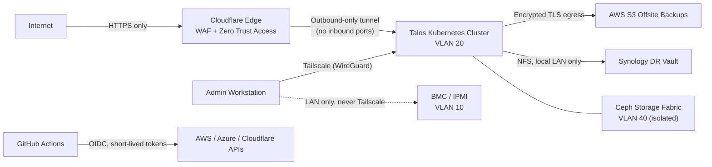

# 🔐 Security Policy & Threat Model

This repository declares a personal hybrid homelab (Talos Linux Kubernetes, Rook-Ceph, UniFi, Cloudflare, AWS, Azure) and a nix-darwin macOS workstation. It holds **no customer data and no production service for anyone else**. Even so, it is engineered and documented as if it were regulated infrastructure, because this is where I practice the controls I would apply professionally.

This document covers:

1. How to report a vulnerability
2. What the system protects and from whom (threat model)
3. Which controls are in place, and where they live in code
4. Which risks are knowingly accepted, and why
5. What is planned next

---

## 1. 📣 Reporting a Vulnerability

If you find a leaked credential, personal data, or a weakness in the published configuration, please report it privately:

- **Preferred:** [GitHub private vulnerability reporting](https://github.com/bar2sek/personal-technology/security/advisories/new) for this repository.
- Please **do not** open a public issue or pull request for security reports.

| Expectation | Target |
| :--- | :--- |
| Acknowledgement | Within 7 days (best effort; this is a one-person project) |
| Credential exposure | Revoked and rotated immediately on confirmation |
| Fix or documented risk decision | Within 30 days |

> [!NOTE]
> There is no bug bounty. Please do not test against live endpoints under `bar2sek.com`. Review of the published code and configuration is welcome; probing running services is not.

**Supported versions:** only the `main` branch is maintained. Historical commits are not patched.

---

## 2. 🎯 Threat Model

### Assets (highest value first)

| Asset | Why it matters |
| :--- | :--- |
| Cloud control-plane identities (AWS, Azure, Cloudflare, GitHub) | Compromise allows changes to cloud resources and DNS, plus billing abuse |
| Cluster control plane (Sidero Omni, Talos API, Kubernetes API) | Full control of every node and workload |
| Identity provider (Authentik, federated to Microsoft Entra ID) | Gatekeeper for every self-hosted application |
| Backups (Postgres dumps, cluster-state archives) | Contain application data and cluster configuration |
| Personal application data (finance, vehicle telemetry, recipes) | Private personal records |
| Workstation (macOS) | Holds admin credentials for every system above |

### Adversaries in scope

- **Opportunistic internet attackers:** credential stuffing, scanning, and exploitation of known vulnerabilities in exposed services.
- **Supply-chain compromise:** a malicious or hijacked container image, Helm chart, GitHub Action, or package.
- **Readers of this public repository:** anyone mining the code or its git history for secrets or reconnaissance.
- **A compromised workload inside the cluster:** attempting lateral movement.
- **Loss or theft of the workstation.**

### Out of scope

Nation-state adversaries, physical attacks on the home network, and attacks on upstream providers (GitHub, Cloudflare, AWS, Microsoft) themselves.

### Trust boundaries



---

## 3. 🛡️ Security Controls

Every control below either lives in this repository, or is called out explicitly as configured outside it.

### 3.1 Identity & Access

- **No static cloud credentials in CI.** GitHub Actions authenticates to AWS and Azure through OIDC workload identity federation. Tokens are minted per job and short-lived. See [`bootstrap/aws/oidc.tf`](bootstrap/aws/oidc.tf) and [`bootstrap/azure/entra.tf`](bootstrap/azure/entra.tf).
- **Immutable subject claims.** Federated trust references only the repository's immutable numeric ID. A renamed or re-created repository cannot inherit trust. The format was verified against CloudTrail before the mutable subjects were removed.
- **Least-privilege CI identities.** Pull request plans assume a read-only AWS role that can't read data (no S3 objects outside the state bucket, no secrets). Production applies assume a separate role scoped to the resources Terraform manages. Any IAM role CI creates must carry a permissions boundary, so the pipeline cannot escalate itself to administrator. These guarantees were checked with IAM Access Analyzer and the IAM policy simulator. See [`bootstrap/aws/oidc.tf`](bootstrap/aws/oidc.tf) and [OIDC GitOps](docs/409-github-azure-oidc-gitops.md).
- **Centralized SSO.** Administrative web UIs (Omni, Grafana, Ceph) sit behind Cloudflare Zero Trust Access, and the published applications are covered by Access policies. Authentik federates to Microsoft Entra ID, where MFA is enforced. See [Identity & SSO](docs/403-identity-sso-authentik-aws.md) and [Entra ID Federation](docs/407-azure-entra-id-authentik-federation.md).
- **Kubernetes RBAC.** Backup jobs use dedicated ServiceAccounts. The Postgres backup job can read exactly one named Secret, via `resourceNames`, in one namespace. See [`cronjob-postgres.yaml`](kubernetes/infrastructure/backups/cronjob-postgres.yaml).
- **Talos API.** In-cluster access to the Talos API is limited to the read-only `os:reader` role from `kube-system`. Talos has no SSH and no shell, and is managed only through its mTLS API.

### 3.2 Secrets Management

- **Nothing secret is committed.** Every Kubernetes Secret, Terraform variable file, and credential has a tracked `*.example` template with placeholder values. [`.gitignore`](.gitignore) enforces an invariant: for every tracked `X.example.Y`, the real `X.Y` is ignored.
- **Account identifiers stay out of code.** The AWS account ID is never written to tracked files. The S3 state backend uses partial configuration, and the bucket name is injected at `init` time.
- **CI secrets are scoped.** Identifiers that grant no access are stored as Actions *variables*. Real secrets are stored as Actions *secrets*, scoped to the `production` environment where possible.
- **Workstation secrets stay outside Nix.** API keys are never written to the Nix store, because the store is world-readable. They come from an uncommitted local file at shell start.

### 3.3 Network Security

- **No inbound ports.** Public applications are reached only through an outbound-only Cloudflare Tunnel. The home WAN exposes no listening services.
- **VLAN segmentation** on the UDM-Pro zone-based firewall:

  | VLAN | Purpose |
  | :--- | :--- |
  | 10 | Out-of-band management (BMC/IPMI). Deliberately excluded from Tailscale routes; see [`connector.yaml`](kubernetes/infrastructure/tailscale/connector.yaml). |
  | 20 | Kubernetes control plane |
  | 40 | Ceph storage fabric. Blocked from all non-cluster zones. |
  | IoT / Guest | Blocked from all RFC1918 ranges |

  See [UniFi Topology](docs/201-unifi-network-topology.md).
- **Remote administration** uses the Tailscale mesh VPN (WireGuard). No admin interface is published to the internet without an Access policy in front of it.
- **TLS** comes from cert-manager with Let's Encrypt (DNS-01). A wildcard certificate terminates at ingress.

### 3.4 Platform & Workload Hardening

- **Immutable OS.** Talos Linux has a read-only root filesystem, no package manager, no SSH, and is configured only through an API.
- **Pinned images.** Container images are pinned to explicit version tags. No `:latest` tags remain.
- **Verified downloads.** Binaries fetched at job runtime (such as `kubectl`) are checked against a pinned SHA-256 before execution.
- **Pod Security Admission.** Namespaces that need elevated access (`privileged`, for example for mDNS/AirPrint host networking) are labeled explicitly, and the reason is documented. A `restricted` default for all namespaces is on the roadmap.
- **VM access.** KubeVirt guests lock all passwords and accept SSH keys only.

### 3.5 Data Protection & Recovery

The backup strategy is 3-2-1. See the [Backups README](kubernetes/infrastructure/backups/README.md) and the [Synology DR runbook](docs/307-garage-synology-dr-time-machine.md).

| Copy | Location | Protections |
| :--- | :--- | :--- |
| Primary | Rook-Ceph | Replicated across nodes; `reclaimPolicy: Retain` |
| Offsite | AWS S3 | Versioned; server-side encrypted; all public access blocked |
| Local | Synology NAS | Separate physical failure domain (detached building); LAN-only |

The S3 uploader identity cannot delete objects, and versioning preserves anything that gets overwritten. Terraform state lives in a versioned, encrypted, private S3 bucket with native state locking. It is never stored locally.

### 3.6 Software Supply Chain & CI/CD

- **No untrusted code on home infrastructure.** Workflows triggered by public pull requests run only on ephemeral GitHub-hosted runners, and declare read-only `GITHUB_TOKEN` permissions. The in-cluster self-hosted runner is registered only to a private repository and authenticates as a GitHub App rather than with a personal token. Its pods run as non-root, with no Kubernetes API token. See [ARC](docs/302-github-actions-runner-controller.md).
- **Validation on every change.** Pull requests run `fmt -check`, `validate`, and a speculative `plan`. Changes are applied only after merge to `main`, through the `production` GitHub Environment.
- **Repository governance as code.** On the deployment repository, Terraform declares branch protection that requires a pull request for every change to `main` (enforced for admins), blocks force-pushes, and enables Dependabot vulnerability alerts. CI jobs hold read-only repository tokens and never push. See [`bootstrap/github/`](bootstrap/github/).
- **Provider pinning.** Terraform provider versions are locked with committed `.terraform.lock.hcl` files.

### 3.7 Workstation (nix-darwin)

- **Declarative configuration.** The macOS configuration is declared in [`nix-mac/templates/flake.nix`](nix-mac/templates/flake.nix) and reproducible from a pinned `flake.lock`.
- **Firewall.** The application firewall with stealth mode is declared in code.
- **Baseline.** FileVault, SIP, Gatekeeper, automatic security updates, and disabled guest login are enforced on the reference machine.
- **Python isolation.** Python tooling runs only through `uv`/`uvx` isolated environments. System Python is never modified.

### 3.8 Repository Hygiene

- **Public by default.** Every repository is treated as public, including its full git history.
- **Commit identity.** Commits use a GitHub `noreply` address only.
- **Secret scanning.** The full history is scanned for leaked credentials before publication. The most recent scan (2026-10-04, gitleaks, all commits) had no findings. To reproduce:

  ```bash
  nix run nixpkgs#gitleaks -- git . --redact --no-banner
  ```
- **Sanitization.** Personal data, public IPs, and local filesystem paths are removed before commit.

---

## 4. ⚖️ Accepted Risks

These are known and deliberate. Each is reviewed when the threat model changes.

| Risk | Rationale | Compensating controls |
| :--- | :--- | :--- |
| Hardware MAC addresses persist in early git history, and Talos machine UUIDs embed NIC MACs | LAN-only identifiers with negligible exploit value. Rewriting public history would break clones. | All addressing is RFC1918. MACs are not used for authentication anywhere. |
| Single maintainer: pull requests require 0 approvals | A one-person project cannot do two-person review | PR-only changes to `main` enforced for admins too; a speculative plan on every PR; environment-gated apply; full audit trail in git |
| `no_tls_verify` on Cloudflare Tunnel → in-cluster ingress hops | Traffic never leaves the cluster network. Internal certificates are self-signed. | The tunnel itself is mutually authenticated and encrypted end to end to the edge |
| Sidero Omni runs on a single node | Homelab hardware budget | Documented Omni state backup and restore runbook ([Omni Architecture](docs/108-omni-dex-platform-architecture.md)). Talos nodes keep running if Omni is offline. |
| A static client secret for the Entra ID ↔ Cloudflare Access integration | Cloudflare's OIDC integration requires a client secret | Stored only as a GitHub Actions secret. Expires after one year, as declared in [`entra.tf`](bootstrap/azure/entra.tf). |
| Some namespaces run `privileged` (CUPS, Home Assistant, backups) | mDNS/SSDP discovery and NFS mounts require host access | Limited to named namespaces; documented per workload |
| UniFi inter-VLAN firewall rules are managed in the UniFi UI, not Terraform | Provider coverage for zone-based firewall policies is incomplete | Rules are documented as a policy matrix in [UniFi Topology](docs/201-unifi-network-topology.md) |

---

## 5. 🗺️ Hardening Roadmap

Ordered by priority. Items move into §3 when completed.

- [ ] **Encrypted backups by default.** Mandatory client-side `age` encryption for every backup artifact, using a public key only, so the cluster can write backups but never read them. Add S3 Object Lock for immutability.
- [ ] **Phishing-resistant admin access.** Require IdP-backed MFA (passkeys) on every Zero Trust Access policy.
- [ ] **Workload identity for on-prem → AWS.** Replace the remaining static backup credential with IAM Roles Anywhere, backed by a cert-manager–issued certificate.
- [ ] **East-west segmentation.** Migrate the CNI from Flannel to Cilium, and adopt default-deny NetworkPolicies per namespace.
- [ ] **Pod hardening baseline.** `restricted` Pod Security Admission by default. `runAsNonRoot`, `readOnlyRootFilesystem`, all capabilities dropped, and the `RuntimeDefault` seccomp profile on every workload.
- [ ] **Ingress controller migration.** Move from ingress-nginx, which upstream retired in March 2026, to the Gateway API.
- [ ] **GitOps reconciliation.** Adopt Flux or Argo CD with pinned Helm chart versions, so cluster state continuously matches `main`.
- [ ] **CI supply chain.** Pin GitHub Actions to commit SHAs, verify the checksum of every downloaded binary, and add Dependabot for Actions.
- [ ] **Declarative workstation baseline.** Codify immediate screen lock, Touch ID for `sudo`, and update policy in `flake.nix`. Move API keys to the macOS Keychain, and move SSH keys to the Secure Enclave.
- [ ] **Repository governance as code.** Bring this repository under the same Terraform-managed branch protection, required status checks, secret scanning, and push protection as the deployment repository.

---

## 6. 🔁 Review Cadence

- **Quarterly:** full configuration review, git-history secret scan, and dependency/version currency check.
- **On every new internet-exposed service:** threat model and §4 updated before exposure.
- **On any suspected compromise:** rotate affected credentials first, then investigate. Findings are recorded in the [Deployment Journal](docs/001-deployment-journal.md).

*Last reviewed: 2026-10-04*
