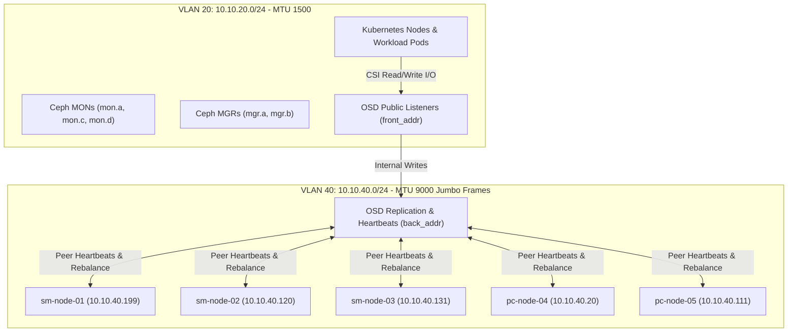

# Phase 2: Rook-Ceph 3-Tier Distributed Storage Cluster & 10GbE Storage Fabric

This guide details the production architecture, network isolation model, and operational runbooks for **[Rook-Ceph](https://rook.io/)** (Ceph v19 Squid) deployed across the 5-node hybrid Talos Linux homelab cluster.

---

## 💾 3-Tier Storage Pool Topology

The cluster provides block (`RBD`), distributed shared filesystem (`CephFS`), and object storage across 3 distinct hardware performance tiers:

| Storage Tier | Physical Drive Pool | Raw Capacity | Usable Pools | Intended Workloads |
| :--- | :--- | :--- | :--- | :--- |
| **Tier 1 (High-IOPS NVMe)** | 2x 2TB Sabrent Rocket Q NVMe (`sm-node-01/02`) + 1x 1TB Crucial P3 Plus (`pc-node-04`) + 1x 1TB Crucial P3 (`pc-node-05`) | **6.0 TB** | `nvme-high-iops-pool` | PostgreSQL/Redis databases, etcd WAL, Ceph RocksDB/WAL metadata, low-latency app PVCs. |
| **Tier 2 (SATA SSD Replicated)** | 8x 2TB Crucial MX500 SATA SSDs (`sm-node-01`: 2, `sm-node-02`: 2, `sm-node-03`: 4) | **16.0 TB** | `builtin-ssd-pool`, `ceph-filesystem` | Replicated Block (`RBD`) & File (`CephFS`) PVCs for active homelab applications. |
| **Tier 3 (Bulk HDD Array)** | 9x Mechanical HDDs in `pc-node-04` (4x 4TB NAS + 2TB Enterprise + 3TB + 1.5TB + 2x 1TB) | **22.5 TB** | `hdd-bulk-pool` | Erasure-coded bulk object storage, Velero backups, media archives, cold data. |

> [!NOTE]
> All storage drives are declared strictly using immutable `/dev/disk/by-id/` symlinks in `kubernetes/infrastructure/rook-ceph/cluster.yaml`. Boot drives (SuperDOMs on Supermicro nodes, SATA DOMs, and OS NVMe drives) are strictly excluded from Ceph disk filtering.

---

## 🌐 Dual-Network Architecture & Storage Isolation (VLAN 40)

To eliminate contention between high-throughput Ceph replication traffic and Kubernetes API / application pod networking, Ceph operates on a **split-plane dual network**:



### Network Plane Responsibilities:

1. **Public Network (`10.10.20.0/24`, MTU 1500)**:
   - Client read/write operations initiated by Ceph CSI drivers (`rbd.csi.ceph.com`, `cephfs.csi.ceph.com`).
   - Ceph Monitor (`MON`) election and consensus heartbeat traffic.
   - Ceph Manager (`MGR`) telemetry, dashboard, and Prometheus metrics.
   - OSD client socket bindings (`front_addr` on port 6800+).

2. **Cluster Network (`10.10.40.0/24`, MTU 9000 - Jumbo Frames)**:
   - East-West OSD data replication across fault domains.
   - OSD peer failure detection heartbeats (`hb_back_addr`).
   - Dynamic placement group (PG) peering, backfill, and cluster recovery traffic.
   - OSD intra-cluster socket bindings (`back_addr` on port 6800+).

---

## 🔌 Node Physical Interfaces & Network Addressing

| Node Name | Machine UUID | Primary Interface (VLAN 20, MTU 1500) | Storage Interface (VLAN 40, MTU 9000) | Switch Port / Uplink |
| :--- | :--- | :--- | :--- | :--- |
| **`sm-node-01`** | `da165a00...` | `eno7np2` (`10.10.20.199`) | `eno8np3.40` (`10.10.40.199`) | SFP+ 10GbE to `Ceph-USW-Aggregation` Port 3 |
| **`sm-node-02`** | `9983ae00...` | `eno7np2` (`10.10.20.120`) | `eno8np3.40` (`10.10.40.120`) | SFP+ 10GbE to `Ceph-USW-Aggregation` Port 4 |
| **`sm-node-03`** | `00000000...` | `ens6f0` (`10.10.20.131`) | `ens6f1.40` (`10.10.40.131`) | SFP+ 10GbE to `Ceph-USW-Aggregation` Port 5 |
| **`pc-node-04`** | `927ef8ab...` | `enp43s0f0` (`10.10.20.20`) | `enp43s0f1.40` (`10.10.40.20`) | SFP+ 10GbE to `Ceph-USW-Aggregation` Port 1 |
| **`pc-node-05`** | `7a7d25b8...` | `enp12s0` (`10.10.20.111`, Native Untagged) | `enp12s0.40` (`10.10.40.111`, Tagged 802.1Q) | 2.5GbE Onboard RJ45 to SFP+ Multi-Gig Transceiver |

> [!IMPORTANT]
> **Talos Subnet Anchoring Invariant**:
> When nodes possess multiple active subnets (`10.10.20.0/24` and `10.10.40.0/24`), Talos must be explicitly instructed which subnet anchors the Kubernetes node internal IP. In `talos/cluster-template.yaml`, `cluster-common` defines:
> ```yaml
> machine:
>   kubelet:
>     nodeIP:
>       validSubnets:
>         - 10.10.20.0/24
> ```
> This prevents Kubelet from arbitrarily picking a storage network IP for pod CNI tunnels or API routing.

> [!WARNING]
> **Ceph `mon.d` DHCP Binding Invariant**:
> Ceph `mon.d` on `sm-node-02` binds to `--public-addr=10.10.20.121`, which is assigned via DHCP on the parent interface `eno8np3`. When declaring the tagged sub-interface `eno8np3.40` in Talos, `dhcp: true` MUST remain on `eno8np3` so `mon.d` never loses its listening address and drops out of quorum.

---

## ⚙️ Declarative Rook-Ceph Network Specification

In `kubernetes/infrastructure/rook-ceph/cluster.yaml`:

```yaml
apiVersion: ceph.rook.io/v1
kind: CephCluster
metadata:
  name: rook-ceph
  namespace: rook-ceph
spec:
  cephVersion:
    image: quay.io/ceph/ceph:v19.2.1
    allowUnsupported: false
  network:
    provider: host
    ipFamily: IPv4
    addressRanges:
      public:
        - 10.10.20.0/24
      cluster:
        - 10.10.40.0/24
```

Rook translates this manifest into Ceph configuration options stored directly in the Ceph MON configuration database:
- `global/advanced/public_network = 10.10.20.0/24`
- `global/advanced/cluster_network = 10.10.40.0/24`

---

## 🔍 Verification & Operational Runbooks

### 1. Check Overall Ceph Cluster Health
```bash
kubectl -n rook-ceph exec deploy/rook-ceph-tools -- ceph status
```

### 2. Verify Global Network Declarations in Ceph Config DB
```bash
kubectl -n rook-ceph exec deploy/rook-ceph-tools -- ceph config dump | grep -i network
```
*Expected Output:*
```text
global advanced cluster_network 10.10.40.0/24 *
global advanced public_network  10.10.20.0/24 *
```

### 3. Verify Dual Socket Bindings on OSD Daemons
```bash
kubectl -n rook-ceph exec deploy/rook-ceph-tools -- ceph osd metadata <osd-id> | grep -E 'front_addr|back_addr'
```
*Expected Output:*
```json
    "back_addr": "[v2:10.10.40.x:6800/...,v1:10.10.40.x:6801/...]",
    "front_addr": "[v2:10.10.20.x:6800/...,v1:10.10.20.x:6801/...]",
    "hb_back_addr": "[v2:10.10.40.x:6802/...,v1:10.10.40.x:6803/...]",
    "hb_front_addr": "[v2:10.10.20.x:6802/...,v1:10.10.20.x:6803/...]"
```

### 4. Test Unfragmented MTU 9000 Jumbo Frames (Don't Fragment Ping)
Launch an ephemeral diagnostic pod on any node with `hostNetwork: true` in `kube-system`:
```bash
kubectl -n kube-system run mtu-test --rm -it --image=alpine:3.20 --overrides='{"spec":{"hostNetwork":true,"nodeName":"sm-node-01"}}' -- sh -c "apk add --no-cache iputils >/dev/null 2>&1 && ping -c 3 -M do -s 8972 10.10.40.120"
```
*(Payload $8972 + 8 \text{ ICMP} + 20 \text{ IPv4} = 9000 \text{ bytes}$. Exit code 0 confirms jumbo frames traverse the switch fabric without fragmentation.)*
