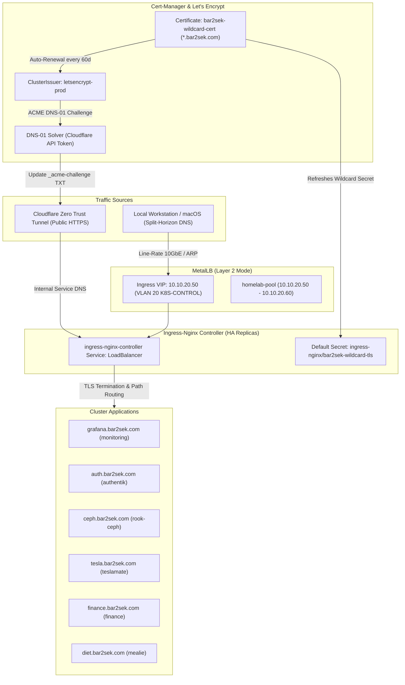

# 🌐 Ingress Traffic Architecture: MetalLB, Ingress-Nginx & Cert-Manager

This document details the L2/L4 load balancing, L7 HTTP ingress routing, and automated TLS certificate lifecycle powering all internal and external web workloads across the Talos Linux bare-metal cluster.

---

## 🏛️ Ingress Architecture & Request Flow

The cluster implements a three-tier ingress pipeline separating Layer-2 VIP allocation, Layer-7 reverse proxying, and automated ACME DNS-01 certificate renewal:



---

## 1. ⚖️ MetalLB Layer-2 Load Balancing

* **Manifests**: `kubernetes/infrastructure/metallb/`
* **Mode**: Layer 2 (ARP-based speaker failover across nodes).
* **VIP Address Pool (`homelab-pool`)**:
  * Range: `10.10.20.50 - 10.10.20.60` (carved out cleanly on VLAN 20 `K8S-CONTROL`, safely below the dynamic DHCP pool `10.10.20.200 - 10.10.20.254`).
* **L2 Advertisement**: Broadcasts gratuitous ARPs for active service VIPs across all participating Talos nodes.

```yaml
apiVersion: metallb.io/v1beta1
kind: IPAddressPool
metadata:
  name: homelab-pool
  namespace: metallb-system
spec:
  addresses:
    - 10.10.20.50-10.10.20.60
  autoAssign: true
---
apiVersion: metallb.io/v1beta1
kind: L2Advertisement
metadata:
  name: homelab-l2-advertisement
  namespace: metallb-system
spec:
  ipAddressPools:
    - homelab-pool
```

---

## 2. 🚦 Ingress-Nginx Controller

* **Manifests**: `kubernetes/infrastructure/ingress/`
* **Helm Values**: `kubernetes/infrastructure/ingress/values.yaml`
* **Core Characteristics**:
  * Pinned static LoadBalancer IP: `10.10.20.50`.
  * High-Availability: 2 replicas with pod anti-affinity.
  * Default TLS termination: Configured with `default-ssl-certificate: "ingress-nginx/bar2sek-wildcard-tls"`.
  * Header preservation: `use-forwarded-headers: "true"` and `compute-full-forwarded-for: "true"` preserve real client IP addresses across Cloudflare Zero Trust and local LAN.

---

## 3. 🔐 Cert-Manager & Automated DNS-01 Wildcard Certificates

* **Manifests**: `kubernetes/infrastructure/cert-manager/`
* **ClusterIssuer**: `letsencrypt-prod` (and `letsencrypt-staging` for sandbox validation).
* **Challenge Mechanism**: ACME **DNS-01** challenge via the Cloudflare API provider. This enables automated issuance of wildcard certificates (`*.bar2sek.com`) without exposing port 80 to the public internet.
* **Certificate Resource**:
  * Name: `bar2sek-wildcard-cert`
  * Namespace: `ingress-nginx`
  * Target Secret: `bar2sek-wildcard-tls`
  * Domains: `bar2sek.com`, `*.bar2sek.com`
  * Renewal: Automatically re-evaluated and refreshed 30 days prior to expiration.

---

## 🛠️ Verification & Troubleshooting

```bash
# 1. Verify MetalLB IP pool and speaker advertisements
kubectl -n metallb-system get ipaddresspools,l2advertisements
kubectl -n metallb-system get pods -o wide

# 2. Verify Ingress-Nginx controller VIP assignment
kubectl -n ingress-nginx get svc ingress-nginx-controller
# Expected output: EXTERNAL-IP = 10.10.20.50

# 3. Check Wildcard Certificate status and validity
kubectl -n ingress-nginx get certificate,certificaterequest
kubectl describe certificate bar2sek-wildcard-cert -n ingress-nginx

# 4. Test local HTTPS endpoint with TLS verification
curl -kI https://10.10.20.50 -H "Host: grafana.bar2sek.com"
```
