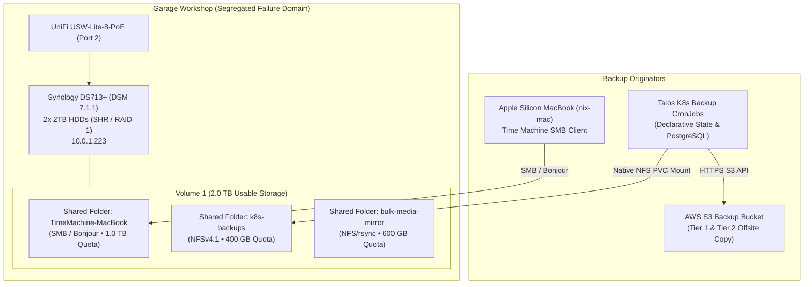

# 🛡️ Garage Synology NAS: Time Machine & Local Tier-3 DR Mirroring

This runbook guides the complete end-to-end onboarding of the **Garage Synology NAS (DiskStation DS713+)**, establishing a physically segregated failure domain for continuous macOS workstation backups (`nix-mac`) and automated local Tier-3 disaster recovery mirroring for the Talos Kubernetes cluster.

---

## 🏗️ Architecture & Failure Domain Isolation



### Key Architectural Tenets
1. **Physical Failure Domain Segregation**: The NAS is physically deployed in the detached garage workshop on `USW-Lite-8-PoE` (Port 2). If the main house or server rack experiences a localized power surge, thermal event, or hardware failure, the garage vault remains isolated and intact.
2. **3-2-1 Data Protection (target)**:
   - **3 Copies**: Production Rook-Ceph storage, offsite AWS S3 bucket (`s3-aws-backups-prod-use2-001`), and local garage Synology NAS.
   - **2 Media Types**: High-speed Ceph block storage & Synology SHR mechanical hard drive array.
   - **1 Offsite Copy**: AWS S3 in `us-east-2`.
3. **Zero-Egress Rapid Recovery**: Cluster state and database dumps mirrored locally over NFS, enabling local recovery without S3 egress costs or WAN connectivity.

> [!WARNING]
> **Status (2026-10-05): the Kubernetes NFS mirror (Phase 5) is not live.** The NAS and Time Machine are onboarded, but the NFS PersistentVolume/Claim were never deployed, so the backup jobs never wrote to the NAS. The mirror was removed from the CronJobs during backup hardening. Today there are two copies (Ceph + immutable S3). Phase 5 below is the plan for restoring the third.

---

## 💽 Phase 1: Storage Pool & Volume Initialization (DSM)

> [!TIP]
> **Why Wipe and Create a Clean Storage Pool?**
> If your DS713+ contains an older SHR/RAID volume from past installations, reformatting is strongly recommended. Legacy pools often use outdated superblock formats, can lack proper shared folder quota enforcement, or retain orphaned DSM packages. A fresh pool guarantees optimal 4K sector alignment, clean Btrfs/ext4 metadata, and guaranteed quota isolation.

### Step-by-Step DSM Pool Setup:
1. Log into DSM: `https://10.0.1.223:5001`
2. Open **Storage Manager** > **Storage**.
3. If an old volume exists and contains no needed data:
   - Select the volume / pool -> Click **Remove**.
4. Click **Create** > **Create Storage Pool**:
   - **RAID Type**: Select **Synology Hybrid RAID (SHR)** (or **RAID 1**). Both provide 1-drive fault tolerance across the 2x 2TB disks.
   - Select both 2TB hard drives.
   - Perform drive check (recommended for newly slotted drives).
5. Click **Create Volume**:
   - Assign to Storage Pool 1.
   - Allocate **Max Capacity** (~1.8 - 2.0 TB usable).
   - **File System**: Select **Btrfs** if available on your DSM build (or **ext4**).

---

## 📂 Phase 2: Dedicated Shared Folders & Quotas

To prevent Apple Time Machine from expanding indefinitely and filling the entire storage pool, strict folder/user quotas are enforced.

### 1. Create `TimeMachine-MacBook` Shared Folder
1. Go to **Control Panel** > **Shared Folder** > **Create**.
2. **Name**: `TimeMachine-MacBook`.
3. **Recycle Bin**: **Uncheck** "Enable Recycle Bin" (*Critical: Time Machine manages its own snapshot pruning; recycle bins cause quota errors*).
4. **Encryption**: Leave unencrypted (Time Machine handles client-side FileVault encryption directly).
5. **Advanced Settings**:
   - If using Btrfs, check **Enable shared folder quota** and set to **1000 GB** (1.0 TB).
   - (If using ext4, user quota on `tm-macbook` will enforce this limit in Phase 3).
6. Click **Next** to save.

### 2. Create `k8s-backups` Shared Folder (NFS DR Target)
1. Go to **Control Panel** > **Shared Folder** > **Create**.
2. **Name**: `k8s-backups`.
3. **Recycle Bin**: Uncheck.
4. **Quota**: Set to **400 GB**.
5. Switch to the **NFS Permissions** tab and click **Create**:
   - **Hostname or IP**: `10.10.20.0/24` *(Kubernetes node CIDR)* and/or `10.0.0.0/16` *(Homelab subnet)*.
   - **Privilege**: `Read/Write`.
   - **Squash**: `No mapping` (or `Map root to admin`).
   - **Security**: `sys`.
   - **Enable asynchronous**: Checked.
   - **Allow connections from non-privileged ports (>1024)**: **Checked** (*Required for Kubernetes NFS client mounts*).
   - **Allow users to access mounted subfolders**: Checked.
6. Click **Apply**. Note the mount path displayed at the bottom: `/volume1/k8s-backups`.

---

## 👤 Phase 3: Service Accounts & File Services

### 1. Create Dedicated Time Machine Service User
1. Go to **Control Panel** > **User & Group** > **Create** > **Create User**.
2. **Name**: `tm-macbook`.
3. Set a strong password (and record securely in 1Password / Keychain).
4. **Group**: `users` only (do NOT assign to `administrators`).
5. **Permissions**:
   - `TimeMachine-MacBook`: **Read/Write**.
   - All other shared folders: **No Access**.
6. **User Quota** (if ext4): Set `TimeMachine-MacBook` quota to **1000 GB**.
7. **Applications**: Deny access to DSM desktop applications (DSM, File Station, etc.) to enforce least privilege.

### 2. Enable SMB & Bonjour Time Machine Broadcast
1. Go to **Control Panel** > **File Services** > **SMB**:
   - Check **Enable SMB service**.
   - **Workgroup**: `WORKGROUP`.
   - Click **Advanced Settings** > Ensure **Minimum SMB protocol** is `SMB2` and **Maximum** is `SMB3`.
2. Switch to **Advanced** tab:
   - Check **Enable Bonjour service discovery to locate DiskStation**.
   - Check **Enable Bonjour Time Machine broadcast via SMB**.
   - Click **Set Up Time Machine Folders**.
   - Select `TimeMachine-MacBook` and click **Apply**.

### 3. Enable NFS Service
1. Go to **Control Panel** > **File Services** > **NFS**:
   - Check **Enable NFS service**.
   - **Maximum NFS protocol**: `NFSv4.1` (or `NFSv3`).
   - Click **Apply**.

---

## 💻 Phase 4: `nix-mac` Time Machine Configuration

Configure the macOS workstation (`nix-mac`) to authenticate and back up continuously to the Synology SMB share.

### 1. Save SMB Credentials in macOS Keychain
```bash
security add-internet-password -a "tm-macbook" -s "10.0.1.223" -r "smb " -w "<YOUR_TM_PASSWORD>"
```

### 2. Set Time Machine Destination
```bash
sudo tmutil setdestination -p "smb://tm-macbook:<YOUR_TM_PASSWORD>@10.0.1.223/TimeMachine-MacBook"
```

### 3. Exclude Ephemeral & Reproducible Directories
Because `nix-mac` is declaratively managed via `flake.nix` and system stores are fully reproducible, excluding them saves massive backup space and bandwidth:

```bash
# Exclude reproducible Nix store
sudo tmutil addexclusion -p /nix

# Exclude local user and application caches
sudo tmutil addexclusion -p "$HOME/Library/Caches"

# Exclude Google Drive local mirror (already backed up in cloud)
sudo tmutil addexclusion -p "$HOME/Library/CloudStorage"

# Exclude temporary build outputs
sudo tmutil addexclusion -p "$HOME/.cargo"
sudo tmutil addexclusion -p "$HOME/.rustup"
```

### 4. Verify & Trigger Initial Backup
```bash
# Verify destination binding
tmutil destinationinfo

# Start initial backup run
tmutil startbackup --auto
```

---

## ☸️ Phase 5: Kubernetes Tier-3 Local DR Mirroring (Planned)

> [!NOTE]
> Not yet deployed. See the status warning under *Key Architectural Tenets*.

The NFS PersistentVolume and Claim are codified in `kubernetes/infrastructure/backups/` (`pv-synology-nfs.yaml`, `pvc-synology-nfs.yaml`) but not applied. To bring the mirror online:

1. **Confirm the NFS export** on DSM allows the Kubernetes node subnet (`10.10.20.0/24`), with read/write access.
2. **Apply and bind the volume:**
   ```bash
   kubectl apply -f kubernetes/infrastructure/backups/pv-synology-nfs.yaml
   kubectl apply -f kubernetes/infrastructure/backups/pvc-synology-nfs.yaml
   kubectl get pvc -n backups pvc-synology-nfs-backups
   ```
3. **Re-add the mirror to the CronJobs.** Mount the PVC and copy the **already-encrypted** `*.age` artifact after the S3 upload. Never mirror plaintext: the NAS must hold only the same ciphertext as S3.
4. **Test** with a manual job, and confirm a `*.age` file appears on the share.
5. **Update** the Backups README tier table and SECURITY.md §3.5.

NFS volumes are mounted by the kubelet, so this does not require privileged pods.

---

## 🚨 Emergency Disaster Recovery Runbook (once Phase 5 is live)

Restore from the NAS when offsite access is unavailable. The artifacts are `age`-encrypted, so the offline identity is still required. Full procedure: Backups README, *Restore Runbook*.

```bash
mkdir -p /Volumes/SynologyBackups
mount_nfs 10.0.1.223:/volume1/k8s-backups /Volumes/SynologyBackups
ls -lt /Volumes/SynologyBackups/cluster-state/
mkdir -p ~/restore && age -d -i /path/to/homelab-backups.identity.age /Volumes/SynologyBackups/cluster-state/<archive>.tar.gz.age | tar -xzf - -C ~/restore
```
