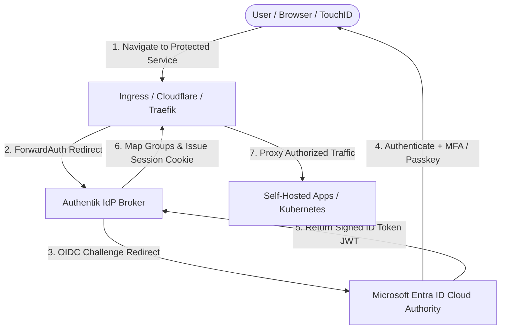

# 🔐 Microsoft Entra ID & Authentik Enterprise Identity Federation

This document defines the enterprise identity federation architecture connecting **Microsoft Entra ID (Free Tier)** as the cloud authoritative identity provider with our local **[Authentik](https://goauthentik.io/)** instance operating as the internal identity broker on our Talos Linux cluster.

---

## 🏛️ Architecture Overview & Token Flow

In enterprise hybrid cloud architectures, organizations decouple external identity providers (Cloud IdPs like Entra ID or Okta) from internal application identity brokers. This ensures that internal workloads (Kubernetes RBAC, local forward-auth reverse proxies, LDAP consumers) do not each require individual cloud app registrations, while cloud security policies and centralized MFA remain strictly enforced.



### Key Architectural Layers:
1. **Cloud Identity Authority (Entra ID Free)**: Authoritative source of truth for identities (`username@bar2sek.com`), security groups, and MFA enforcement.
2. **Local Identity Broker (Authentik)**: Ingests Entra ID tokens via OIDC, extracts group claims, maps them to local permissions, and brokers access to self-hosted apps and AWS IAM Identity Center.
3. **Downstream Targets**: Kubernetes API (`kubectl`), Cloudflare Access, AWS Console/CLI, and internal web applications (Immich, Mealie, TeslaMate).

---

## 🌐 Custom Domain Integration (`bar2sek.com`)

The **Microsoft Entra ID Free Tier** permanently supports up to 900 custom domains without requiring paid Microsoft 365 or Entra ID P1/P2 licenses.

### 1. Domain Verification Flow in Cloudflare DNS
To brand directory identities with `@bar2sek.com` instead of the default `@<tenant>.onmicrosoft.com`:

1. In the **Microsoft Entra Admin Center**, navigate to **Identity > Settings > Domain names > Add custom domain**.
2. Input `bar2sek.com`.
3. Entra ID generates a verification TXT record:
   * **Type**: `TXT`
   * **Name**: `@` (or `bar2sek.com`)
   * **Value**: `MS=msXXXXXXXX`
   * **TTL**: `3600`
4. Add this TXT record to your Cloudflare DNS zone for `bar2sek.com` (declared via `terraform/cloudflare`).
5. In Entra Admin Center, click **Verify** and mark `bar2sek.com` as the **Primary Domain**.

### 2. User Principal Name (UPN) Strategy
* Primary Administrator: `ryan@bar2sek.com`
* Break-Glass Account: `admin@<tenant>.onmicrosoft.com` (exempt from external federation dependencies)

---

## 🛠️ Declarative Entra ID Provisioning via Terraform

In accordance with our [[105-naming-conventions|Enterprise Naming Standards]], all Entra ID objects are managed as declarative code in `bootstrap/azure/`:

### 1. Naming Conventions Applied
* **Application Registration**: `app-azure-authentik-prod-001`
* **Enterprise Application (Service Principal)**: `sp-azure-authentik-prod-001`
* **IdP Security Groups**:
  * `entraid-azure-homelab-prod-<tenant-4>-admin` (Platform Administrator)
  * `entraid-azure-homelab-prod-<tenant-4>-reader` (Auditor / Read-Only Access)
  * `entraid-authentik-homelab-prod-<tenant-4>-member` (Standard SSO Access)

*(Note: `<tenant-4>` is dynamically derived from the first 4 characters of the Azure Tenant ID GUID).*

### 2. Declarative HCL (`bootstrap/azure/entra.tf`)
```hcl
# Entra ID App Registration for Authentik
resource "azuread_application" "authentik" {
  display_name     = "app-azure-authentik-prod-001"
  sign_in_audience = "AzureADMyOrg"

  web {
    redirect_uris = [
      "https://auth.bar2sek.com/source/oauth/callback/entra-id/"
    ]
  }

  required_resource_access {
    resource_app_id = "00000003-0000-0000-c000-000000000000" # Microsoft Graph

    resource_access {
      id   = "e1fe6dd8-ba31-4d61-89e7-88639da4683d" # User.Read
      type = "Scope"
    }
  }

  group_membership_claims = ["SecurityGroup"]
}

# Enterprise Application Service Principal
resource "azuread_service_principal" "authentik" {
  client_id = azuread_application.authentik.client_id
}

# Declarative RBAC Security Group
resource "azuread_group" "homelab_admin" {
  display_name     = "entraid-azure-homelab-prod-${local.tenant_4}-admin"
  security_enabled = true
}
```

---

## ⚙️ Authentik Inbound OIDC Source Configuration

Inside Authentik's Administration UI (**System > Sources > Create OpenID Connect Source**):

| Configuration Field | Parameter Value | Architectural Purpose |
| :--- | :--- | :--- |
| **Name** | `Microsoft Entra ID` | Display name on the login stage |
| **Slug** | `entra-id` | Matches callback URL `/source/oauth/callback/entra-id/` |
| **Consumer Key (Client ID)** | Output from `terraform output entra_client_id` | Identifies Authentik to Entra |
| **Consumer Secret** | Output from `terraform output -raw entra_client_secret` | Authenticates client token requests |
| **Authorization URL** | `https://login.microsoftonline.com/<tenant-id>/oauth2/v2.0/authorize` | OIDC Authorization Endpoint |
| **Token URL** | `https://login.microsoftonline.com/<tenant-id>/oauth2/v2.0/token` | OIDC Token Issuance Endpoint |
| **OIDC JWKS URL** | `https://login.microsoftonline.com/<tenant-id>/discovery/v2.0/keys` | Public keys verifying Entra signatures |
| **User Info URL** | `https://graph.microsoftonline.com/oidc/userinfo` | Profile claim resolution |
| **Additional Scopes** | `openid email profile` | Standard OIDC identity claims |

### Group Ingestion & Transformation Policy
Authentik automatically translates Entra ID security group Object IDs into local Authentik roles using an **Enrollment Policy Expression**:

```python
# Authentik Property Mapping for Entra ID Groups
groups = request.context.get("oauth_userinfo", {}).get("groups", [])
admin_group_id = "<entraid-admin-group-object-id>"

if admin_group_id in groups:
    ak_group = Group.objects.get(name="authentik-admins")
    user.ak_groups.add(ak_group)
```

---

## 🎓 Enterprise Interview Talking Points & Mental Models

When discussing this architecture in senior platform or cloud engineering interviews, highlight the following design patterns:

### 1. The "Identity Broker" Pattern (Token Chaining)
* **Problem**: Registering 20 distinct self-hosted homelab applications directly in Entra ID creates massive operational sprawl, requires managing 20 client secrets, and tightly couples applications to Microsoft.
* **Solution**: Place an internal broker (Authentik) in the middle. Entra ID issues a single cloud assertion to Authentik; Authentik performs **claims translation** and issues localized tokens or session headers to downstream Kubernetes workloads.

### 2. Multi-Cloud Identity Federation (AWS + Azure)
* Authentik can federate upstream to Entra ID via OIDC, while simultaneously federating downstream to **AWS IAM Identity Center** via SAML 2.0.
* This demonstrates how enterprises bridge Microsoft-centric enterprise identities into multi-account AWS landing zones with centralized MFA and auditing.

### 3. Attack Surface Reduction
* Your local Kubernetes API and internal web apps never expose administrative login prompts to the public internet. Authentication challenges are redirected to Microsoft's globally distributed, DDoS-hardened login endpoints (`login.microsoftonline.com`).

---

## 🔍 Verification & Diagnostic Runbook

1. **Verify Terraform Azure State**:
   ```bash
   cd bootstrap/azure && terraform plan
   ```
2. **Test OIDC Discovery Metadata**:
   ```bash
   curl -s https://login.microsoftonline.com/<tenant-id>/v2.0/.well-known/openid-configuration | jq .issuer
   ```
3. **Inspect Authentik Source Health**:
   * Log out of Authentik.
   * Navigate to `https://auth.bar2sek.com`.
   * Click **Sign in with Microsoft Entra ID**.
   * Verify authentication successfully redirects and auto-provisions the user with group membership.
