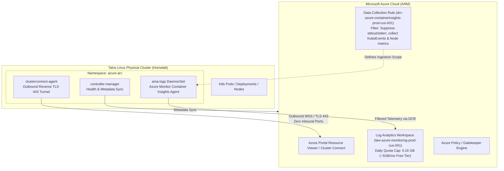

# 🌐 Azure Arc-Enabled Kubernetes & Zero-Cost Cloud Monitoring

This document details the declarative architecture, Terraform implementation, and operational runbook for onboarding our bare-metal **Talos Linux Kubernetes Cluster** to **Microsoft Azure Arc** with strict, mathematical zero-cost monitoring guardrails.

---

## 🏛️ Architecture & Hybrid Connectivity Topology

Unlike Azure Arc for *Servers* (which requires installing an RPM/DEB agent on the host OS and is incompatible with Talos Linux's immutable, package-less design), **Azure Arc for *Kubernetes*** is 100% CNCF-compliant. It runs entirely as in-cluster containerized pods inside the `azure-arc` namespace.



### Key Architectural Invariants:
1. **Zero Open Firewall Ports**: Azure Arc establishes an encrypted, outbound-only WebSocket reverse tunnel (`clusterconnect-agent`) over TCP port 443. No inbound port forwarding or firewall pinholes are required on our UniFi Dream Machine Pro.
2. **Strict Daily Ingestion Quota**: Azure Log Analytics charges ~$2.30/GB after the first 5 GB/month. By setting a hard ceiling of `daily_quota_gb = 0.16` in Terraform, we guarantee that data ingestion will automatically halt before incurring any charges.
3. **Selective Telemetry Streams**: Azure Monitor Data Collection Rules (DCR) suppress noisy application stdout/stderr streams, capturing only `KubeEvents`, `KubeNodeInventory`, and `KubePodInventory`.

---

## 🛠️ Declarative Terraform Provisioning (`terraform/azure/arc.tf`)

In accordance with our [[105-naming-conventions|Enterprise Naming Standards]], all Azure Arc resources are managed declaratively:

| Resource Type | Resource Identifier | Standardized Name | Purpose |
| :--- | :--- | :--- | :--- |
| **Resource Group** | `azurerm_resource_group` | `rg-azure-homelab-prod-cus-001` | Central US (`cus`) lifecycle container |
| **Log Analytics** | `azurerm_log_analytics_workspace` | `law-azure-monitoring-prod-cus-001` | Daily quota: `0.16 GB` ($0 tier cap) |
| **Connected Cluster** | `azurerm_arc_kubernetes_cluster` | `arc-azure-talos-prod-cus-001` | Physical Talos cluster anchor |
| **Container Extension**| `azurerm_arc_kubernetes_cluster_extension` | `dcr-azure-containerinsights-prod-cus-001` | Managed Azure Monitor agent extension |

### Declarative HCL Configuration
```hcl
# Dedicated Homelab Resource Group
resource "azurerm_resource_group" "homelab" {
  name     = "rg-azure-homelab-prod-${var.location_short}-001"
  location = var.location
}

# Cost-Guarded Log Analytics Workspace
resource "azurerm_log_analytics_workspace" "monitoring" {
  name                = "law-azure-monitoring-prod-${var.location_short}-001"
  location            = azurerm_resource_group.homelab.location
  resource_group_name = azurerm_resource_group.homelab.name
  sku                 = "PerGB2018"
  retention_in_days   = 30

  # Strict 0.16 GB/day limit (~4.8 GB/month), well within Azure's 5GB free tier!
  daily_quota_gb = 0.16
}

# Azure Arc Connected Kubernetes Cluster
resource "azurerm_arc_kubernetes_cluster" "talos" {
  name                = "arc-azure-talos-prod-${var.location_short}-001"
  resource_group_name = azurerm_resource_group.homelab.name
  location            = azurerm_resource_group.homelab.location
  agent_public_key_certificate = filebase64("${path.module}/certs/arc-agent.cer")
  identity {
    type = "SystemAssigned"
  }
}
```

---

## 📊 KQL (Kusto Query Language) Observability Playbook

One of the greatest benefits of Azure Arc is gaining hands-on production experience with **KQL**—the query engine underpinning Azure Monitor, Microsoft Sentinel, and Defender for Cloud.

### 1. Detect CrashLoopBackOff and Failed Pods
```kql
KubePodInventory
| where TimeGenerated > ago(24h)
| where PodStatus == "Failed" or ContainerStatus == "CrashLoopBackOff"
| summarize RestartCount = max(ContainerRestartCount) by Namespace, Name, ContainerStatus
| order by RestartCount desc
```

### 2. Physical Node Memory Pressure & Disk Pressure Events
```kql
KubeNodeInventory
| where TimeGenerated > ago(1h)
| project TimeGenerated, Computer, Status, KubeletVersion, DiskPressure, MemoryPressure
| order by TimeGenerated desc
```

### 3. Cluster Warning Events (OOMKills & Storage Failures)
```kql
KubeEvents
| where TimeGenerated > ago(6h)
| where Type == "Warning"
| project TimeGenerated, Namespace, ObjectKind, Name, Reason, Message
| order by TimeGenerated desc
```

---

## 🎓 Enterprise Interview Talking Points & Mental Models

### 1. Azure Arc vs. AWS EKS Connector vs. Google Distributed Cloud
* **AWS EKS Connector**: Primarily an inventory and console visualizer. It links an external cluster to the AWS Console but offers limited out-of-the-box policy enforcement without complex SSM and ACK chaining.
* **Azure Arc**: A true **hybrid control plane projection**. It projects Azure Resource Manager (ARM) capabilities—Azure Policy (Gatekeeper/OPA), Microsoft Defender for Containers, Azure Monitor, and Flux v2 GitOps—directly onto any CNCF Kubernetes cluster.
* **Talking Point**: *"I federated our on-premise Talos Linux cluster to both AWS (via EKS Connector) and Azure (via Azure Arc). While AWS was ideal for our S3 backup pipelines and IAM federation, Azure Arc provided superior centralized governance through Azure Policy and KQL-based Container Insights."*

### 2. Multi-Tier Observability: Local PromQL vs. Cloud KQL
* **Local Tier (Prometheus + Grafana)**: Sub-second scrape intervals for real-time alerting and operational dashboards within the local LAN.
* **Cloud Tier (Azure Monitor + KQL)**: Off-site post-mortem survival. If local Ceph storage fails or power drops, Log Analytics preserves the diagnostic logs leading up to the failure.

---

## 🔍 Verification & Diagnostic Runbook

1. **Verify Azure Arc Pods in Kubernetes**:
   ```bash
   just arc-status
   # Or directly:
   kubectl -n azure-arc get pods -o wide
   ```
2. **Test Azure Portal Cluster Connect**:
   * Navigate to `portal.azure.com` $\to$ **Azure Arc > Kubernetes clusters**.
   * Select `arc-azure-talos-prod-cus-001`.
   * Click **Namespaces**, **Nodes**, or **Workloads** to verify zero-trust cluster browsing over the reverse tunnel.
3. **Verify Daily Log Analytics Ingestion Quota**:
   * In Azure Portal, navigate to `law-azure-monitoring-prod-cus-001` $\to$ **Usage and estimated costs > Daily cap**.
   * Confirm that the daily cap is active and pinned to `0.16 GB`.
