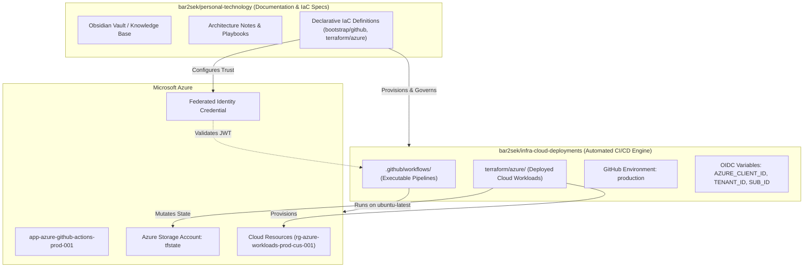
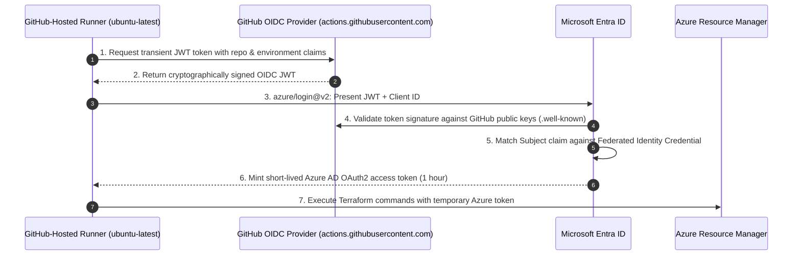

# GitHub Actions & Azure OIDC GitOps Deployment Engine

This document outlines the architecture, security invariants, and operational runbook for executing automated cloud deployments via **GitHub Actions** using **OpenID Connect (OIDC) Workload Identity Federation** and a dedicated GitOps repository (**`infra-cloud-deployments`**).

---

## 🏛️ Architectural Separation: Documentation vs. Deployments

In enterprise platform engineering, mixing automated execution pipelines, deployment variables, and CI/CD runtime state into an architectural knowledge base introduces security, operational, and cognitive friction:



### Key Advantages of Multi-Repo Separation
1. **Zero Secret Leaks in Notes**: The knowledge vault remains clean, publishable, and completely decoupled from deployment runtime tokens and workflow status badges.
2. **Environment Protection Gates**: GitHub Environments (`production`) can enforce deployment approvals, required reviewers, and branch restrictions exclusively on the deployment repository.
3. **Traceability**: Every production change generates a traceable deployment record with direct links to commits, PRs, and Azure Activity Logs.

---

## 🔐 Zero-Trust Authentication: OIDC Workload Identity Federation

Rather than generating long-lived, expiring client secrets (`ARM_CLIENT_SECRET`) and storing them in GitHub repository secrets, this architecture relies on **RFC 7519 OpenID Connect (OIDC)** federated trust between GitHub and Microsoft Entra ID.

### The Token Exchange Lifecycle



### Subject Claim Specification
Entra ID evaluates incoming JWTs against the configured `subject` string:
* **Production Environment Deployments**:
  ```
  repo:bar2sek/infra-cloud-deployments:environment:production
  ```
* **Pull Request Speculative Planning**:
  ```
  repo:bar2sek/infra-cloud-deployments:pull_request
  ```

---

## 📦 Declarative Components

### 1. GitHub Infrastructure as Code (`bootstrap/github/`)
The deployment repository and its governance are declared in `bootstrap/github/`:
* **`github_repository.infra_cloud_deployments`**: Creates the standalone deployment repo with automated security alerts.
* **`github_repository_environment.production`**: Enforces branch policies (deployments restricted to `main`).
* **`github_actions_environment_variable`**: Declaratively sets `AZURE_CLIENT_ID`, `AZURE_TENANT_ID`, and `AZURE_SUBSCRIPTION_ID`.
* **`github_branch_protection.main`**: Requires pull requests before code merges to `main`.

### 2. Azure Entra ID & State Storage (`terraform/azure/`)
Azure identity and backend resources are declared in `terraform/azure/`:
* **`azuread_application.github_actions`**: App registration `app-azure-github-actions-prod-001`.
* **`azuread_service_principal.github_actions`**: Service principal `sp-azure-github-actions-prod-001`.
* **`azuread_application_federated_identity_credential`**: Maps GitHub subject claims to Entra ID.
* **`azurerm_role_assignment.github_actions_contributor`**: Grants `Contributor` permissions to the subscription.
* **`azurerm_storage_account.tfstate`**: Remote state storage account (`stazutfstateprodcus001`) with Entra ID authentication enforced (`shared_access_key_enabled = false`).
* **`azurerm_role_assignment.github_actions_tfstate`**: Grants `Storage Blob Data Contributor` to the runner service principal.

---

## 🚀 Bootstrap & Operational Runbook

### Step 1: Provision Azure Identity & State Storage
From the `personal-technology` repository root:
```bash
# 1. Review Azure plan (Entra ID App, OIDC Federated Credential, Storage Account)
just tf-plan-azure

# 2. Apply Azure configuration
just tf-apply-azure
```

### Step 2: Provision GitHub Repository & Environment
```bash
# 1. Provide GitHub PAT via environment variable (or terraform.tfvars)
export GITHUB_TOKEN="ghp_xxxxxxxxxxxxxxxxxxxx"

# 2. Review GitHub plan (Creates infra-cloud-deployments repo, environment, variables)
just tf-plan-github

# 3. Apply GitHub configuration
just tf-apply-github
```

### Step 3: Publish Initial Deployment Code
Navigate to the newly scaffolded repository in the vault workspace:
```bash
cd ../infra-cloud-deployments

# Add the remote (created by Terraform)
git remote add origin git@github.com:bar2sek/infra-cloud-deployments.git

# Stage and commit the initial workflow and terraform configs
git add .
git commit -m "feat: initial commit of automated Azure CI/CD pipeline"
git push -u origin main
```

### Step 4: Verify First Traceable Deployment
1. Navigate to **GitHub $\rightarrow$ `bar2sek/infra-cloud-deployments` $\rightarrow$ Actions**.
2. Observe the automated workflow triggering on `push` to `main`.
3. Verify step `Azure Login via OIDC Workload Identity Federation` exchanges tokens successfully with zero static secrets.
4. Verify `terraform apply` provisions resources and saves state into `stazutfstateprodcus001/tfstate`.

---

## 🛠️ Troubleshooting & Gotchas

### 1. `AADSTS70021: No matching federated identity record found`
* **Cause**: The incoming token's subject claim does not match the Entra ID federated credential.
* **Fix**: Check the GitHub workflow run logs to see the exact subject string. Ensure the repository name or environment name matches `subject = "repo:bar2sek/infra-cloud-deployments:environment:production"`.

### 2. `AuthorizationPermissionMismatch` on Azure Blob Storage
* **Cause**: The runner is attempting to read/write state without `Storage Blob Data Contributor` RBAC.
* **Fix**: Ensure `azurerm_role_assignment.github_actions_tfstate` is applied and propagation has completed (~2 minutes in Azure AD).
