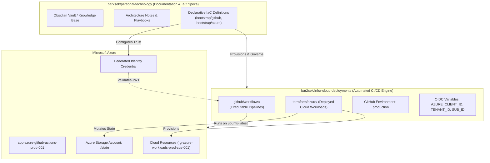
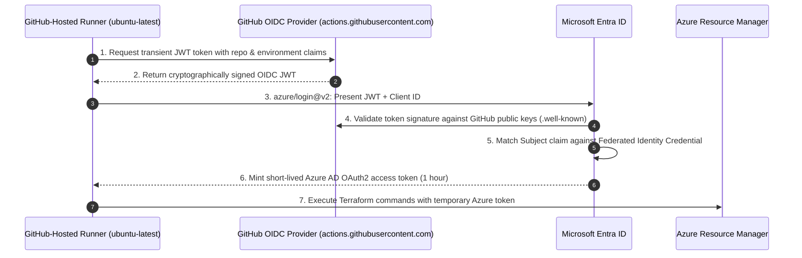
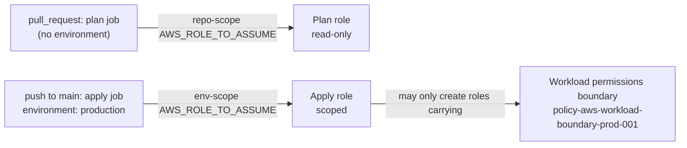

# GitHub Actions & Azure OIDC GitOps Deployment Engine

This document outlines the architecture, security invariants, and operational runbook for executing automated cloud deployments via **GitHub Actions** using **OpenID Connect (OIDC) Workload Identity Federation** and a dedicated GitOps repository (**`infra-cloud-deployments`**).

---

## 🏛️ Architectural Separation: Documentation vs. Deployments

In enterprise platform engineering, mixing automated execution pipelines, deployment variables, and CI/CD runtime state into an architectural knowledge base introduces security, operational, and cognitive friction:


```mermaid
graph TD
    subgraph Repo1["bar2sek/personal-technology (Documentation & IaC Specs)"]
        Vault["Obsidian Vault / Knowledge Base"]
        Docs["Architecture Notes & Playbooks"]
        TF_Roots["Declarative IaC Definitions (bootstrap/github, bootstrap/azure)"]
    end

    subgraph Repo2["bar2sek/infra-cloud-deployments (Automated CI/CD Engine)"]
        Workflows[".github/workflows/ (Executable Pipelines)"]
        Live_IaC["terraform/azure/ (Deployed Cloud Workloads)"]
        GH_Env["GitHub Environment: production"]
        Env_Vars["OIDC Variables: AZURE_CLIENT_ID, TENANT_ID, SUB_ID"]
    end

    subgraph Cloud["Microsoft Azure"]
        Entra_App["app-azure-github-actions-prod-001"]
        OIDC_Trust["Federated Identity Credential"]
        Azure_Storage["Azure Storage Account: tfstate"]
        Live_Resources["Cloud Resources (rg-azure-workloads-prod-cus-001)"]
    end

    TF_Roots -->|Provisions & Governs| Repo2
    TF_Roots -->|Configures Trust| OIDC_Trust
    Workflows -->|Runs on ubuntu-latest| Cloud
    OIDC_Trust -.->|Validates JWT| Workflows
    Live_IaC -->|Mutates State| Azure_Storage
    Live_IaC -->|Provisions| Live_Resources
```

### Key Advantages of Multi-Repo Separation
1. **Zero Secret Leaks in Notes**: The knowledge vault remains clean, publishable, and completely decoupled from deployment runtime tokens and workflow status badges.
2. **Environment Protection Gates**: GitHub Environments (`production`) can enforce deployment approvals, required reviewers, and branch restrictions exclusively on the deployment repository.
3. **Traceability**: Every production change generates a traceable deployment record with direct links to commits, PRs, and Azure Activity Logs.

---

## 🔐 Zero-Trust Authentication: OIDC Workload Identity Federation

Rather than generating long-lived, expiring client secrets (`ARM_CLIENT_SECRET`) and storing them in GitHub repository secrets, this architecture relies on **RFC 7519 OpenID Connect (OIDC)** federated trust between GitHub and Microsoft Entra ID.

### The Token Exchange Lifecycle


```mermaid
sequenceDiagram
    autonumber
    participant Runner as GitHub-Hosted Runner (ubuntu-latest)
    participant GH_OIDC as GitHub OIDC Provider (actions.githubusercontent.com)
    participant Entra as Microsoft Entra ID
    participant ARM as Azure Resource Manager

    Runner->>GH_OIDC: 1. Request transient JWT token with repo & environment claims
    GH_OIDC-->>Runner: 2. Return cryptographically signed OIDC JWT
    Runner->>Entra: 3. azure/login@v2: Present JWT + Client ID
    Entra->>GH_OIDC: 4. Validate token signature against GitHub public keys (.well-known)
    Entra->>Entra: 5. Match Subject claim against Federated Identity Credential
    Entra-->>Runner: 6. Mint short-lived Azure AD OAuth2 access token (1 hour)
    Runner->>ARM: 7. Execute Terraform commands with temporary Azure token
```

### Subject Claim Specification
Entra ID evaluates incoming JWTs against the configured `subject` string:
* **Production Environment Deployments**:
  ```
  repo:bar2sek/infra-cloud-deployments:environment:production
  ```
* **Pull Request Speculative Planning**:
  ```
  repo:bar2sek/infra-cloud-deployments:pull_request
  ```

---

## 📦 Declarative Components

### 1. GitHub Infrastructure as Code (`bootstrap/github/`)
The deployment repository and its governance are declared in `bootstrap/github/`:
* **`github_repository.infra_cloud_deployments`**: Creates the standalone deployment repo with automated security alerts.
* **`github_repository_environment.production`**: Enforces branch policies (deployments restricted to `main`).
* **`github_actions_variable.shared` / `github_actions_environment_variable.production`**: Declaratively set `AZURE_CLIENT_ID`, `AZURE_TENANT_ID`, `AZURE_SUBSCRIPTION_ID`, `AWS_ROLE_TO_ASSUME`, and `AWS_REGION` at **both** repository and environment scope, driven from a single `locals` map. The one deliberate difference: repository-scope `AWS_ROLE_TO_ASSUME` is the read-only **plan** role (`aws_plan_role_arn`), while the `production` environment keeps the **apply** role (`aws_role_arn`). See §3.
* **`github_actions_secret.shared` / `github_actions_environment_secret.production`**: Set `AWS_TF_STATE_BUCKET` as a masked secret at both scopes.
* **`github_branch_protection.main`**: Requires pull requests before code merges to `main`, **enforced for admins too** (`enforce_admins = true`). The owner can still self-merge (0 required approvals), but cannot push directly, so every production apply is preceded by a speculative plan on a PR.

> [!IMPORTANT] Why both scopes
> GitHub resolves lookups with precedence `environment > repository > organization`. The PR `plan` job in `aws-deploy.yml` / `azure-deploy.yml` declares **no** `environment:` key—deliberately, since adding one would subject every pull request to the `production` approval gate and defeat the speculative plan. Environment-scoped values are therefore invisible to it, and a repository-scoped baseline is required. The environment-scoped copies remain as `production` overrides and as the extension point for future `staging`/`dev` environments.

> [!WARNING] Variables vs. secrets
> `AWS_TF_STATE_BUCKET` is a **secret**, not a variable, because the bucket name embeds the AWS account ID and is interpolated into a `run:` command—which Actions echoes verbatim into publicly readable logs. Secrets are masked to `***`; variables are not. The OIDC identifiers stay variables: they confer no access without a matching federated credential, and keeping them readable preserves Terraform drift detection (`github_actions_secret` is write-only, so Terraform tracks only a hash).

### 2. Azure Entra ID & State Storage (`bootstrap/azure/`)
Azure identity and backend resources are declared in `bootstrap/azure/`:
* **`azuread_application.github_actions`**: App registration `app-azure-github-actions-prod-001`.
* **`azuread_service_principal.github_actions`**: Service principal `sp-azure-github-actions-prod-001`.
* **`azuread_application_federated_identity_credential`**: Maps GitHub subject claims to Entra ID.
* **`azurerm_role_assignment.github_actions_contributor`**: Grants `Contributor` permissions to the subscription.
* **`azurerm_storage_account.tfstate`**: Remote state storage account (`stazutfstateprodcus001`) with Entra ID authentication enforced (`shared_access_key_enabled = false`).
* **`azurerm_role_assignment.github_actions_tfstate`**: Grants `Storage Blob Data Contributor` to the runner service principal.

---

### 3. AWS IAM: Split Plan / Apply Roles (`bootstrap/aws/oidc.tf`)

A pull request must never hold write access to the cloud account. Each pipeline stage therefore assumes its own role, and each role trusts **exactly one** immutable subject claim:

| Role | Trusted `sub` | Permissions |
| :--- | :--- | :--- |
| `role-aws-github-plan-prod-001` | `repo:bar2sek@6226865/infra-cloud-deployments@1378897273:pull_request` | `ReadOnlyAccess`, minus data-plane reads (S3 objects outside the state bucket, Secrets Manager, SSM parameters, KMS decrypt, DynamoDB items, S3 vectors, AgentCore memory), plus write access to `*.tflock` only |
| `role-aws-github-actions-prod-001` (apply) | `repo:bar2sek@6226865/infra-cloud-deployments@1378897273:environment:production` | `policy-aws-github-apply-prod-001`: state read/write, `s3-aws-*` bucket **configuration** (never object data, never `DeleteBucket`), `role-aws-*` / `policy-aws-*` management, Bedrock Knowledge Bases / Guardrails / S3 Vectors, objects in `s3-aws-bedrock-*` only, `iam:PassRole` on `role-aws-bedrock-*` to Bedrock only |

No workflow change is needed. Variable precedence (`environment > repository`) hands each job the right role automatically.


```mermaid
graph LR
    PR["pull_request: plan job<br/>(no environment)"] -->|"repo-scope AWS_ROLE_TO_ASSUME"| PLAN["Plan role<br/>read-only"]
    MAIN["push to main: apply job<br/>environment: production"] -->|"env-scope AWS_ROLE_TO_ASSUME"| APPLY["Apply role<br/>scoped"]
    APPLY -->|"may only create roles carrying"| BND["Workload permissions boundary<br/>policy-aws-workload-boundary-prod-001"]
```

**Why a permissions boundary.** Any principal that can create IAM roles and attach policies can normally make itself administrator: it creates a role with `AdministratorAccess` and assumes it. The apply role's privilege-granting actions (`CreateRole`, `AttachRolePolicy`, `PutRolePolicy`, `PutRolePermissionsBoundary`) are conditioned on `iam:PermissionsBoundary` equalling the workload boundary. Every role CI creates is therefore capped at the boundary, whatever policy is attached to it. Explicit denies stop CI from editing its own roles, its own policy, the boundary itself, or removing any boundary. A further explicit Deny (`ProtectBackupBucketGuardrails`) stops CI from changing the backup bucket's policy, Object Lock configuration, versioning, or object retention. Those guardrails are applied from `bootstrap/aws/backups.tf`, so a compromised pipeline cannot loosen the controls that protect backups from it (verified with `aws iam simulate-principal-policy`: `explicitDeny`).

> [!IMPORTANT] Adding a new workload role
> In `infra-cloud-deployments`, every `aws_iam_role` must set `permissions_boundary = local.workload_boundary_arn`. If the workload needs a service the boundary doesn't allow, extend `aws_iam_policy.workload_boundary` **here in bootstrap** and apply it locally. Growing privilege stays a reviewed, human action outside CI.

> [!NOTE] Immutable subjects only
> The trust policies accept only the `owner@id/repo@id` subject format. On 2026-10-04 this was verified from CloudTrail before the mutable `repo:owner/name` and `ref:refs/heads/main` subjects were removed:
> ```bash
> aws cloudtrail lookup-events --region us-east-2 \
>   --lookup-attributes AttributeKey=EventName,AttributeValue=AssumeRoleWithWebIdentity \
>   --query 'Events[].CloudTrailEvent' --output json \
>   | jq -r '.[] | fromjson | .responseElements.subjectFromWebIdentityToken' | sort | uniq -c
> ```

**Verification.** Policies were checked with IAM Access Analyzer (`aws accessanalyzer validate-policy`: zero findings), and the escalation paths were tested with `aws iam simulate-custom-policy`. Creating a role without the boundary, or with a different one, is denied. So are rewriting its own trust policy, attaching a policy to itself, stripping a boundary, reading backup objects, and changing the state bucket's configuration. The actions Terraform needs are allowed.

#### 3a. Amazon Bedrock permissions (added 2026-10-06)

The Bedrock lab in `infra-cloud-deployments` (Knowledge Base on S3 Vectors, Guardrails) needed three kinds of change. Each was applied here, by a human, before any Bedrock Terraform ran in CI.

| Policy | Added | Why |
| :--- | :--- | :--- |
| **Workload boundary** | `bedrock:InvokeModel` on `foundation-model/*` in `us-east-2`; `s3:ListBucket`/`GetObject` on `s3-aws-bedrock-*` (same account only); `s3vectors:GetIndex/PutVectors/GetVectors/QueryVectors/DeleteVectors` on `s3v-aws-bedrock-*` indexes | The ceiling for the Knowledge Base **service role**: embed documents, read the source bucket, write and query vectors. Bucket-name prefixes mean a KB can never be pointed at the state or backup buckets. |
| **Apply role** | Knowledge Base, data source and ingestion-job management; Guardrail management and versioning; vector bucket and index management; object read/write in `s3-aws-bedrock-*` | Terraform owns the full lifecycle, including the synthetic source documents (`aws_s3_object`). This is the single exception to "configuration only, never object data", and it is limited to the Bedrock source bucket. |
| **Apply role** | `iam:PassRole` on `role-aws-bedrock-*`, condition `iam:PassedToService = bedrock.amazonaws.com` | `CreateKnowledgeBase` hands its service role to Bedrock. See below. |
| **Plan role** | Explicit Deny: `s3vectors:GetVectors/ListVectors/QueryVectors`, AgentCore memory record and event reads | AWS-managed `ReadOnlyAccess` (v190) grants these **data-plane** reads. Vectors carry the source text chunks as metadata, so without the Deny a pull request could read the corpus back. |

**Why PassRole needs both limits.** Passing a role to a service lets the service act with that role's permissions. Unscoped `iam:PassRole` is therefore an escalation path: pass a powerful role to a service you can drive, and borrow its permissions.

- The **resource scope** (`role-aws-bedrock-*`) limits *which* roles can be passed. CI can only create roles in that namespace with the workload boundary, so any role it can pass is boundary-capped.
- The **`iam:PassedToService` condition** limits *who receives* the role. Without it, the same roles could be handed to EC2, Lambda, or any other service the pipeline controls.

Deliberately **not** granted:

- `s3vectors:DeleteVectorBucket`: removing a bucket stays a human action, matching the existing no-`DeleteBucket` rule. `DeleteIndex` *is* allowed: an index holds only derived data that re-ingestion rebuilds, and changing an index's dimension forces Terraform to replace it.
- Cross-Region inference profiles and chat models in the boundary. Only Region-pinned embedding models are needed so far; they are added when a workload needs them.
- AgentCore and model-invocation-logging permissions. These arrive with those lab milestones, as separate reviewed changes.

> [!WARNING] Residual risk: the `role-aws-bedrock-*` namespace
> `iam:PassRole` cannot be conditioned on the passed role's permissions boundary. If a *human* creates a role in the `role-aws-bedrock-*` namespace without the boundary, CI could pass it to Bedrock. Treat the prefix as reserved for CI-created, boundary-capped roles.

**Verification** (run after `terraform apply` of this bootstrap):

```bash
cd bootstrap/aws
# 1. Lint the rendered policies. Expect zero ERROR findings; a warning about an
#    unrecognised action means an action name is wrong.
for arn in $(terraform output -raw workload_boundary_policy_arn) \
           "arn:aws:iam::$(aws sts get-caller-identity --query Account --output text):policy/policy-aws-github-apply-prod-001"; do
  aws iam get-policy-version --policy-arn "$arn" \
    --version-id "$(aws iam get-policy --policy-arn "$arn" --query Policy.DefaultVersionId --output text)" \
    --query PolicyVersion.Document --output json > /tmp/policy.json
  aws accessanalyzer validate-policy --policy-type IDENTITY_POLICY \
    --policy-document file:///tmp/policy.json --query 'findings[].[findingType,issueCode]' --output text
done

# 2. PassRole to a non-Bedrock service must be denied (expect implicitDeny).
APPLY=$(terraform output -raw github_actions_role_arn)
ACCT=$(aws sts get-caller-identity --query Account --output text)
aws iam simulate-principal-policy --policy-source-arn "$APPLY" \
  --action-names iam:PassRole \
  --resource-arns "arn:aws:iam::$ACCT:role/role-aws-bedrock-kb-prod-001" \
  --context-entries "ContextKeyName=iam:PassedToService,ContextKeyValues=ec2.amazonaws.com,ContextKeyType=string" \
  --query 'EvaluationResults[].EvalDecision'

# 3. The plan role must not read vectors (expect explicitDeny).
PLAN=$(aws iam get-role --role-name role-aws-github-plan-prod-001 --query Role.Arn --output text)
aws iam simulate-principal-policy --policy-source-arn "$PLAN" \
  --action-names s3vectors:QueryVectors s3vectors:GetVectors \
  --query 'EvaluationResults[].EvalDecision'
```

**Verified 2026-10-06** (applied: 0 added, 3 changed, 0 destroyed; the plan contained 114 added policy lines and 0 removed):

| Check | Result |
| :--- | :--- |
| Access Analyzer: boundary, apply policy, plan-role inline policy | 0 errors, 0 warnings, so all action names are valid. Two `REDUNDANT_RESOURCE` suggestions, kept deliberately (see note below). |
| Apply role: `iam:PassRole` `role-aws-bedrock-*` → `bedrock.amazonaws.com` | `allowed` |
| Apply role: same role → `ec2.amazonaws.com` | `implicitDeny` |
| Apply role: passing **itself** → Bedrock | `explicitDeny` (`ProtectCiIdentityAndBoundary`) |
| Plan role: `s3vectors:QueryVectors`, `GetVectors`, `bedrock-agentcore:RetrieveMemoryRecords` | `explicitDeny` |
| Plan role: `s3vectors:GetIndex`, `bedrock:GetKnowledgeBase`, `bedrock:GetGuardrail` | `allowed` (plan can still refresh) |
| Apply role: `s3:PutObject` / `GetObject` on `s3-aws-bedrock-*` vs the backup bucket | `allowed` vs `implicitDeny` |
| Apply role: `s3vectors:DeleteVectorBucket` | `implicitDeny` |

> [!NOTE] Two simulator and analyzer gotchas
> - **`*` in an ARN matches across `/`.** `arn:aws:s3:::s3-aws-bedrock-*` already matches every object ARN in those buckets, which is why Access Analyzer calls the separate `…/*` entry redundant. Both entries are kept anyway: they state intent (bucket vs objects) and match the AWS-documented pattern.
> - **`simulate-principal-policy` with several `--resource-arns` returns one aggregated `EvalDecision`**: one denied resource makes the whole action read `implicitDeny`. Query `EvaluationResults[].ResourceSpecificResults[].[EvalResourceName,EvalResourceDecision]` to see each resource separately.

---

## 🚀 Bootstrap & Operational Runbook

### Step 1: Provision Azure Identity & State Storage
From the `personal-technology` repository root:
```bash
# 1. Review Azure plan (Entra ID App, OIDC Federated Credential, Storage Account)
just tf-plan-azure

# 2. Apply Azure configuration
just tf-apply-azure
```

### Step 2: Provision GitHub Repository & Environment
```bash
# 1. Provide GitHub PAT via environment variable (or terraform.tfvars)
export GITHUB_TOKEN="ghp_xxxxxxxxxxxxxxxxxxxx"

# 2. Review GitHub plan (Creates infra-cloud-deployments repo, environment, variables)
just tf-plan-github

# 3. Apply GitHub configuration
just tf-apply-github
```

### Step 3: Publish Initial Deployment Code
Navigate to the newly scaffolded repository in the vault workspace:
```bash
cd ../infra-cloud-deployments

# Add the remote (created by Terraform)
git remote add origin git@github.com:bar2sek/infra-cloud-deployments.git

# Stage and commit the initial workflow and terraform configs
git add .
git commit -m "feat: initial commit of automated Azure CI/CD pipeline"
git push -u origin main
```

### Step 4: Verify First Traceable Deployment
1. Navigate to **GitHub $\rightarrow$ `bar2sek/infra-cloud-deployments` $\rightarrow$ Actions**.
2. Observe the automated workflow triggering on `push` to `main`.
3. Verify step `Azure Login via OIDC Workload Identity Federation` exchanges tokens successfully with zero static secrets.
4. Verify `terraform apply` provisions resources and saves state into `stazutfstateprodcus001/tfstate`.

---

## 🛠️ Troubleshooting & Gotchas

### 1. `AADSTS70021: No matching federated identity record found`
* **Cause**: The incoming token's subject claim does not match the Entra ID federated credential.
* **Fix**: Check the GitHub workflow run logs to see the exact subject string. Ensure the repository name or environment name matches `subject = "repo:bar2sek/infra-cloud-deployments:environment:production"`.

### 2. `AuthorizationPermissionMismatch` on Azure Blob Storage
* **Cause**: The runner is attempting to read/write state without `Storage Blob Data Contributor` RBAC.
* **Fix**: Ensure `azurerm_role_assignment.github_actions_tfstate` is applied and propagation has completed (~2 minutes in Azure AD).

### 3. `AccessDenied` in the AWS apply job after a Terraform change

The apply role is scoped to the resource types Terraform manages today. A new resource type (for example a DynamoDB table or an SNS topic) will plan successfully, because the plan role is read-only across the account, but fail to apply. That is the intended failure mode: add the specific actions to `aws_iam_policy.github_apply` in `bootstrap/aws/oidc.tf`, apply bootstrap locally, then re-run the workflow. If the error names `iam:CreateRole` or `iam:AttachRolePolicy`, the new role is missing `permissions_boundary = local.workload_boundary_arn`.

### 4. `GH006: Protected branch update failed` from a CI job

A workflow step tried to `git push` to `main`. This is blocked by design: CI jobs have read-only repository tokens, and branch protection applies to everyone. Architecture diagrams are published as **workflow artifacts** instead of being committed. Download them from the run and include them in a PR. Direct pushes by the owner are also rejected now that `enforce_admins = true`; use a branch and `gh pr create`.

> [!NOTE] Why not required status checks?
> The plan jobs are path-filtered per provider (`terraform/aws/**`, and so on). A required check that never starts, because the PR didn't touch that path, blocks the merge forever. Requiring checks here needs an always-running aggregator job first. That's tracked on the SECURITY.md roadmap.

### 5. `AccessDenied ... iam:PassRole` when creating a Bedrock Knowledge Base

The KB's service role is outside the `role-aws-bedrock-*` namespace, or the role is being passed to a different service. Rename the role to match `role-aws-bedrock-*`; don't widen the PassRole statement. An `AccessDenied` from the KB *ingestion job* (rather than from Terraform) is the service role hitting the **workload boundary**: check that the source bucket is named `s3-aws-bedrock-*` and the vector bucket `s3v-aws-bedrock-*`.
