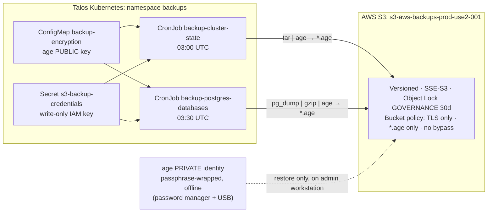

# 💾 Offsite Backups: Encrypted, Immutable, Write-Only

Daily backups of cluster state and PostgreSQL databases, shipped to AWS S3. The design assumes that **the cluster, the upload credential, or the CI pipeline could be compromised**, and still guarantees:

| Guarantee | Enforced by | Verified (2026-10-05) |
| :--- | :--- | :--- |
| Backups are always encrypted; the cluster **cannot decrypt** them | `age` with a public key only; job fails closed | Fail-closed test; ciphertext inspection; restore drill with offline key |
| A stolen upload key can **add** backups but never read, list, or delete them | IAM user policy: `PutObject` on `*.age` only | 11-case permission matrix from an in-cluster pod |
| Nothing unencrypted can be stored, by anyone | IAM policy **and** bucket policy deny non-`*.age` keys | Admin upload of a `.txt` key: `AccessDenied` |
| Backups are **immutable for 30 days**, even to an administrator | S3 Object Lock (governance), bypass denied to all principals | Admin delete / shorten-retention, with and without bypass header: `AccessDenied` |
| CI cannot loosen these guardrails | Guardrails owned by bootstrap; explicit Deny on the CI apply role | IAM policy simulator: `explicitDeny` |
| Backup pods cannot read cluster Secrets | Narrow RBAC; Secrets excluded from dumps | SubjectAccessReview; restored archive has 0 `Secret` objects |

---

## 🏛️ Architecture



### Ownership across repositories

One bucket, deliberately split by **who may change it**:

| Component | Owner | Applied by |
| :--- | :--- | :--- |
| CronJobs, RBAC, ConfigMap (this folder) | `personal-technology` | `kubectl apply` |
| Uploader IAM user + policy, Object Lock config, bucket policy | `personal-technology/bootstrap/aws/backups.tf` | Administrator, locally |
| CI apply-role Deny on those guardrails | `personal-technology/bootstrap/aws/oidc.tf` (`ProtectBackupBucketGuardrails`) | Administrator, locally |
| Bucket, versioning, SSE, public-access block, lifecycle | `infra-cloud-deployments` (`terraform/aws/main.tf`) | GitHub Actions (OIDC) |

**Why the split:** a pipeline must not control the guardrails that protect against that pipeline. Lifecycle can stay in CI because S3 lifecycle never deletes a locked version.

### Backup tiers

| Tier | Data | Schedule | Destination | Status |
| :--- | :--- | :--- | :--- | :--- |
| 1 | Declarative cluster state (CRDs, cluster-scoped resources, namespaced workloads, ConfigMaps, PVCs). **No Secrets.** | 03:00 UTC | `s3://…/cluster-state/*.tar.gz.age` | Active |
| 2 | PostgreSQL: Authentik (active), TeslaMate (when deployed) | 03:30 UTC | `s3://…/postgres/<app>/*.sql.gz.age` | Active |
| 3 | Local mirror on the garage Synology NAS | — | NFS `k8s-backups` share | **Planned.** The NFS PV/PVC were never deployed; the mirror was removed from the jobs on 2026-10-05 until it is wired up and tested. See [[307-garage-synology-dr-time-machine\|Synology DR]]. |

### Retention timeline

```text
day 0   object written, locked (GOVERNANCE) until day 30
day 30  lock expires
day 35  lifecycle expires the current version (becomes noncurrent)
day 36  lifecycle permanently removes it
```

About 36 daily restore points per backup type.

---

## 🔐 Security Design

### 1. Encryption: `age`, fail closed

Each job encrypts to the **public** recipient in [`configmap-backup-encryption.yaml`](configmap-backup-encryption.yaml). Four independent layers stop an unencrypted artifact from leaving the cluster:

1. **Kubernetes:** the ConfigMap is referenced via `envFrom` *without* `optional: true`. If it is missing, the pod never starts (`CreateContainerConfigError`).
2. **Script:** the job exits before reading any data unless `AGE_RECIPIENT` starts with `age1` **and** `age` accepts it.
3. **Data path:** `tar … | age` and `pg_dump | gzip | age` stream straight into the encrypted file. The archive and dump are never written unencrypted. (The cluster-state job's intermediate JSON lives in the pod's ephemeral `/tmp` and is deleted right after encryption.)
4. **AWS:** both the uploader's IAM policy and the bucket policy reject any key not ending in `.age`.

### 2. Identity: write-only uploader

IAM user `svc-aws-backup-uploader-prod-001` (`path = /service/`) may only `s3:PutObject` and `s3:AbortMultipartUpload` on `cluster-state/*.age` and `postgres/*.age`. It has no `GetObject`, `ListBucket`, or `DeleteObject`.

> [!IMPORTANT]
> The access key is **not** a Terraform resource. `bootstrap/aws` uses local state, and `aws_iam_access_key` would write the secret into it in plaintext. The key is minted with the CLI straight into the cluster (see Setup). Roadmap: replace it with IAM Roles Anywhere.

### 3. Immutability: Object Lock (governance)

- **Governance, not compliance.** Compliance-mode objects cannot be removed by anyone, root included, until retention expires. If a mistake ever puts sensitive plaintext into the bucket, you must be able to purge it. Governance keeps that escape hatch, and the bucket policy makes using it a deliberate, logged act: `s3:BypassGovernanceRetention` is denied to **every** principal, so bypassing first requires editing the bucket policy as root or an administrator.
- **Irreversible:** Object Lock can never be disabled on this bucket. The default retention rule can be changed.
- Default retention applies only to **new** object versions.

### 4. Kubernetes RBAC

| ServiceAccount | Can read | Cannot read |
| :--- | :--- | :--- |
| `k8s-backup-sa` (cluster-state) | get/list on the dumped kinds only (see the ClusterRole) | **Any Secret**, Pods |
| `postgres-backup-sa` | `get` on exactly `identity/authentik-secrets` (`resourceNames`) | Every other Secret, including its own S3 credential via the API |

Secrets are excluded from cluster-state on purpose: their real values live in the gitignored counterpart of each `*.example` template, so restoring them means re-applying from those files.

---

## 🛠️ Setup (from scratch)

### 1. Guardrails and uploader identity (administrator, locally)

```bash
cd bootstrap/aws
eval "$(aws configure export-credentials --format env)"   # bridges `aws login` to Terraform
export TF_DATA_DIR=$(mktemp -d)                            # keeps provider binaries out of Google Drive
terraform init -lockfile=readonly
terraform apply
```

The bucket itself must already exist (created by `infra-cloud-deployments` CI). Versioning must be enabled before Object Lock can be.

### 2. Encryption keypair (administrator, offline)

Generate it on the workstation, **outside** the Google Drive vault. The private key is passphrase-wrapped as it is generated, so it never touches disk in plaintext:

```bash
cd ~
age-keygen | age -p -a -o homelab-backups.identity.age
PUB=$(age -d homelab-backups.identity.age | age-keygen -y)
echo "$PUB"
```

Put `$PUB` into [`configmap-backup-encryption.yaml`](configmap-backup-encryption.yaml). Store `homelab-backups.identity.age` in the password manager **and** on an offline USB stick. Store the passphrase as a **separate** password-manager entry, plus on paper. Then delete the copy in `~`.

> [!WARNING]
> The identity file **and** its passphrase are both required to restore. Losing either makes every backup permanently unreadable.

### 3. Namespace, encryption recipient, upload credential

```bash
kubectl apply -f namespace.yaml -f configmap-backup-encryption.yaml

kubectl create secret generic s3-backup-credentials -n backups --from-env-file=<(
  aws iam create-access-key --user-name svc-aws-backup-uploader-prod-001 --output json \
    | jq -r '.AccessKey | "AWS_ACCESS_KEY_ID=\(.AccessKeyId)\nAWS_SECRET_ACCESS_KEY=\(.SecretAccessKey)"'
  printf 'AWS_DEFAULT_REGION=us-east-2\nS3_BUCKET=s3-aws-backups-prod-use2-001\n'
)
```

The secret is never printed or written to disk. Use `kubectl create`, not `apply`: `apply` would store a second copy of the secret in the `last-applied-configuration` annotation. [`backup-credentials.example.yaml`](backup-credentials.example.yaml) documents the shape only.

### 4. CronJobs and RBAC

```bash
kubectl apply -f cronjob-cluster-state.yaml -f cronjob-postgres.yaml
```

Both CronJobs declare `suspend: false` explicitly. `kubectl apply` would otherwise preserve a `suspend: true` set imperatively (for example during an incident), because that field would be absent from last-applied.

---

## ✅ Verification

Re-run these after any change to the jobs, IAM, or bucket policy.

**Manual run:**

```bash
kubectl create job --from=cronjob/backup-cluster-state cs-test -n backups
kubectl create job --from=cronjob/backup-postgres-databases pg-test -n backups
kubectl wait -n backups job/cs-test job/pg-test --for=condition=Complete --timeout=300s
aws s3api head-object --bucket s3-aws-backups-prod-use2-001 --key <new-key>.age \
  --query '[ObjectLockMode,ObjectLockRetainUntilDate]'
```

Expect `GOVERNANCE` and a date 30 days out.

**Fail-closed test** (an explicit `env` overrides `envFrom`). Expect exit 1, `Refusing to back up.`, and no new object:

```bash
kubectl create job --from=cronjob/backup-postgres-databases failclosed-test -n backups --dry-run=client -o json \
  | jq '.spec.backoffLimit=0 | .spec.template.spec.restartPolicy="Never" | .spec.template.spec.containers[0].env=[{"name":"AGE_RECIPIENT","value":""}]' \
  | kubectl create -f -
```

**RBAC: use a SubjectAccessReview, not `kubectl auth can-i --as`** (see Troubleshooting). Expect `false`:

```bash
kubectl create -o jsonpath='{.status.allowed}' -f - <<'EOF'
apiVersion: authorization.k8s.io/v1
kind: SubjectAccessReview
spec:
  user: system:serviceaccount:backups:k8s-backup-sa
  groups: ["system:serviceaccounts", "system:serviceaccounts:backups", "system:authenticated"]
  resourceAttributes: {verb: list, resource: secrets}
EOF
```

**Immutability** (as an administrator, against a locked version). Each must return `AccessDenied`:

```bash
aws s3api delete-object --bucket s3-aws-backups-prod-use2-001 --key <key> --version-id <id>
aws s3api delete-object --bucket s3-aws-backups-prod-use2-001 --key <key> --version-id <id> --bypass-governance-retention
```

---

## 🔄 Restore Runbook

All decryption happens on the **administrator workstation**. The private key never enters the cluster. Work in a scratch directory outside Google Drive, and delete it afterwards. Each `age -d` prompts for the identity passphrase.

### A. Cluster state

```bash
mkdir -p ~/restore && cd ~/restore
aws s3 ls s3://s3-aws-backups-prod-use2-001/cluster-state/
aws s3 cp s3://s3-aws-backups-prod-use2-001/cluster-state/<archive>.tar.gz.age .
age -d -i /path/to/homelab-backups.identity.age <archive>.tar.gz.age | tar -xzf -

kubectl apply -f cluster-scoped/crds.json
kubectl apply -f cluster-scoped/cluster-resources.json
for ns in namespaces/*; do kubectl apply -f "$ns/declarative-resources.json"; done
```

Then re-apply Secrets from their gitignored files (they are not in the archive). Finally, `cd ~ && rm -rf ~/restore`.

### B. PostgreSQL: tested drill (throwaway database)

This exact procedure was run successfully on 2026-10-05 (Authentik, 3 users restored, `ON_ERROR_STOP` clean). Run it periodically to prove backups are restorable:

```bash
kubectl create namespace restore-drill
kubectl run pg-drill -n restore-drill --image=postgres:16-alpine --env=POSTGRES_USER=authentik --env=POSTGRES_PASSWORD=drill-only --env=POSTGRES_DB=authentik
until kubectl exec -n restore-drill pg-drill -- pg_isready -U authentik -q; do sleep 2; done
aws s3 cp s3://s3-aws-backups-prod-use2-001/postgres/authentik/<dump>.sql.gz.age .
age -d -i /path/to/homelab-backups.identity.age <dump>.sql.gz.age | gunzip | kubectl exec -i -n restore-drill pg-drill -- psql -q -v ON_ERROR_STOP=1 -U authentik -d authentik
kubectl exec -n restore-drill pg-drill -- psql -U authentik -d authentik -c "select count(*) from authentik_core_user;"
kubectl delete namespace restore-drill
```

### C. PostgreSQL: production, in place

> [!CAUTION]
> Not yet exercised against production. The dump is plain SQL without `--clean`, so it must be restored into an **empty** database. Stop the application first so it does not write during the restore.

1. Scale the Authentik server and worker deployments to 0 (names are in the Authentik app manifest).
2. Recreate an empty database:
   ```bash
   kubectl exec -n identity deploy/authentik-db -- psql -U authentik -d postgres -c 'DROP DATABASE authentik;' -c 'CREATE DATABASE authentik OWNER authentik;'
   ```
3. Restore, using the same pipeline as the drill, targeting `deploy/authentik-db` in `identity`.
4. Scale Authentik back up and verify login.

---

## 🔁 Rotation

**Upload key:** IAM allows two keys per user, so rotation needs no downtime.
1. Run the `kubectl create secret … --from-env-file=<(aws iam create-access-key …)` block above, after `kubectl delete secret s3-backup-credentials -n backups`.
2. Run a manual job and confirm the upload.
3. Delete the old key: `aws iam delete-access-key --user-name svc-aws-backup-uploader-prod-001 --access-key-id <old>`.

**Encryption key:**
1. Generate a new identity (Setup §2).
2. Update the ConfigMap and apply it.
3. **Keep the old identity for at least 36 days.** Backups encrypted to it stay in the bucket until lifecycle removes them.

---

## 🩺 Troubleshooting & Gotchas

- **`kubectl auth can-i --as=…` always says `yes`.** The Omni Kubernetes proxy drops impersonation headers, so every check is evaluated as the admin user (`kubectl auth whoami --as=<sa>` returns `admin`). Use a SubjectAccessReview (above).
- **Postgres pod logs: `unable to retrieve container logs`.** This is observed consistently for the Postgres backup pods (cluster-state logs on the same node work), and `kubectl logs` still exits 0. Use the S3 object as the source of truth. Open follow-up.
- **Uploads fail with `InvalidRequest` / missing `Content-MD5` after Object Lock.** With default retention, S3 requires an integrity checksum on `PutObject`. The jobs pass `--checksum-algorithm CRC32`, because older aws-cli builds (for example 2.15 on Alpine 3.20) do not send one by default.
- **`AccessDenied` on upload.** The key does not end in `.age`, or the prefix is not `cluster-state/` or `postgres/`. That is a fail-closed guardrail working as intended.
- **Terraform: `No valid credential sources found`** after `aws login`. The AWS provider cannot read the `aws login` cache. Run `eval "$(aws configure export-credentials --format env)"` in the same shell first.
- **zsh pastes.** Interactive zsh does not treat `#` as a comment, does not word-split `$var`, and parses `$VAR:r…` as a modifier. Brace variables (`${VAR}`) and paste commands without trailing comments.
