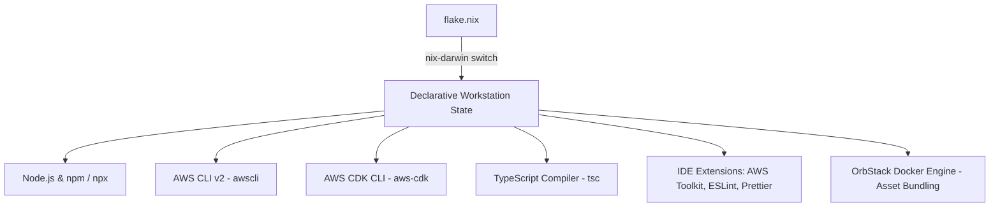

# ☁️ AWS CDK & TypeScript Workstation Guide

This guide documents the declarative workstation architecture, toolchain, verification routines, and operational workflows for building AWS Cloud Development Kit (CDK v2) infrastructure with TypeScript on macOS.

---

## 🏛️ Architecture & Toolchain Overview

All workstation tooling is declared in `templates/flake.nix` and managed via `nix-darwin` and declarative Homebrew integration.



### 1. Declared Packages (`flake.nix`)

| Tool | Package | Management Layer | Purpose |
| :--- | :--- | :--- | :--- |
| **Node.js** | `node` | Homebrew (`brews`) | JavaScript runtime and package manager (`npm`, `npx`) |
| **AWS CLI** | `awscli` | Homebrew (`brews`) | AWS credential and SSO management |
| **AWS CDK CLI** | `aws-cdk` | Homebrew (`brews`) | CDK CLI (`cdk synth`, `cdk diff`, `cdk deploy`) |
| **TypeScript** | `typescript` | Homebrew (`brews`) | Global TypeScript compiler (`tsc`) |
| **OrbStack** | `orbstack` | Homebrew (`casks`) | Docker daemon for CDK container asset bundling (e.g., Lambda Docker builds) |

### 2. IDE Extensions (Antigravity IDE & VS Code)

Declared in the `postActivation` script:
* `amazonwebservices.aws-toolkit-vscode`: AWS resource explorer, CloudWatch logs viewer, and CDK Explorer.
* `dbaeumer.vscode-eslint`: Static code analysis and linting for TypeScript constructs.
* `esbenp.prettier-vscode`: Opinionated code formatting for TypeScript and JSON.

### 3. Shell Aliases (`environment.shellAliases`)

| Shortcut | Expanded Command | Purpose |
| :--- | :--- | :--- |
| `cdks` | `cdk synth` | Synthesize CloudFormation templates from CDK code |
| `cdkd` | `cdk diff` | Compare local CDK state against deployed AWS stack |
| `cdkl` | `cdk list` | List all CDK stacks defined in the current app |
| `cdkw` | `cdk watch` | Continuously monitor and hot-swap Lambda/stack changes |

---

## 🚀 Activation & Verification

### Step 1: Apply Declarative Workstation Configuration

To apply the updated flake to your macOS system:

```bash
just switch
# Or directly:
sudo -H darwin-rebuild switch --flake ~/.config/nix-darwin#MacBook-Pro
```

### Step 2: Verify Installed Tooling

Once switched, open a new shell or run `reload` (`exec zsh`) and check tool availability:

```bash
# Check CDK and TypeScript versions
cdk --version
tsc --version

# Run CDK diagnostics
cdk doctor
```

### Step 3: Verifying AWS Credentials

Ensure your terminal has active AWS credentials configured:

```bash
aws sts get-caller-identity
```

---

## 🛠️ CDK TypeScript Project Workflow

### 1. Initialize a New CDK TypeScript App

```bash
mkdir my-cdk-app && cd my-cdk-app
cdk init app --language typescript
```

This generates:
* `bin/my-cdk-app.ts`: CDK application entry point.
* `lib/my-cdk-app-stack.ts`: Primary infrastructure stack definition.
* `cdk.json`: CDK execution configuration (specifies `ts-node bin/my-cdk-app.ts`).
* `package.json` & `tsconfig.json`: Project dependencies (`aws-cdk-lib`, `constructs`, `typescript`, `ts-node`).

### 2. Standard Development Lifecycle

```bash
# Install project dependencies
npm install

# Synthesize CloudFormation template
cdks

# Compare changes against deployed stack
cdkd

# Deploy stack to AWS
cdk deploy
```

---

## ⚠️ Operational Gotchas & Troubleshooting

> [!IMPORTANT]
> **CDK Bootstrap Requirement**
> Before deploying any CDK stack to an AWS account and region for the first time, the environment must be bootstrapped to provision the CDK S3 staging bucket and ECR repositories:
> ```bash
> cdk bootstrap aws://ACCOUNT-ID/REGION
> ```

> [!TIP]
> **Docker Asset Bundling with OrbStack**
> If you are building containerized Lambda functions or using CDK assets that compile inside Docker (e.g., Python/Go Lambdas), ensure **OrbStack** is running so the Docker socket (`/var/run/docker.sock`) is active.

> [!NOTE]
> **Project-Local vs Global Dependencies**
> While `aws-cdk` and `typescript` are available globally on your workstation for convenience and CLI bootstrapping, CDK projects always pin `aws-cdk-lib` and `constructs` inside their own `package.json`. Always run `npm install` inside each individual CDK project.
